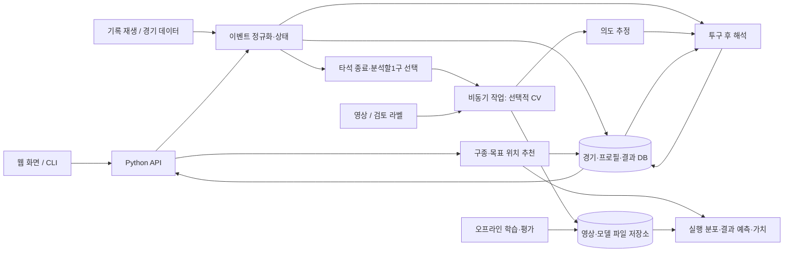

# Pitcheezy 전체 서비스·모듈 아키텍처 초안

2026-09-21. 사용자 요청(D40) 후 전체 설계에 동의했고, D41에서 **선택한 투구만 CV로 분석**하도록 수정했다. **전체 서비스 설계 → 모듈 설계 → 가벼운 전체 구현 → 각 모듈 성능 향상**이 우선순위다. 추천 연구와 논문화는 제품의 핵심 모델을 개선하는 후속 목표다. 세부 구현 계획은 [야간 MVP 계획](OVERNIGHT_MVP_PLAN_20260921.md)을 따른다. 이 문서는 구현 완료를 뜻하지 않는다.

## 1. 사용자 경험과 첫 배포 단위

사용자가 첫 배포 대상을 **야구팬의 관전 보조 서비스**로 확정했다. 사용자가 경기·타석을 선택하고 다음 흐름을 경험한다.

1. 투구 전: 카운트·주자·아웃·점수와 선수 성향을 보고, 추천 구종+목표 구역을 확인한다.
2. 투구 후: 실제 구종·도달 위치·결과를 추천과 같은 화면에서 비교한다.
3. 타석 종료 후: 마지막 공 또는 가장 중요한 투구를 선택해 CV 분석하고, 포수 셋업 추정 위치·실행·결과 설명을 보완한다. 모든 공을 CV로 처리하지 않는다.
4. 타석/경기 요약: 주요 선택과 결과, 주목할 구위·제구 변화, 교체 판단에 필요한 상황을 살펴본다.

첫 통합 버전은 **과거 실제 경기의 투구 순차 재생**으로 만든다. 데이터 공급원만 바꾸면 지연 중계·라이브로 이어지도록 이벤트 계약을 공유한다. 기록 재생 화면도 일반 사용자가 이용할 수 있는 제품 기능이다. 미래 결과를 가린 상태에서 추천을 먼저 저장한 후 실제 결과를 공개한다.

초기 화면은 경기/타석 선택, 스트라이크존의 추천·실제 위치, 추천 후보, 한 구 해설, 타석 요약이면 충분하다. 원본 중계 영상의 호스팅은 핵심 흐름의 전제조건으로 두지 않는다. 사용 가능한 권한·출처가 확인된 클립은 별도 연결한다.

## 2. 모듈과 첫 구현

| 모듈 | 책임과 출력 | 최소 구현 | 개선 지표 |
|---|---|---|---|
| 데이터·시간 정렬 | 경기 이벤트, 투구 ID, 영상 시각 매핑 | 승인된 과거 데이터 재생, 클립-투구 수동 연결 지원 | 누락·중복·순서 오류, 지연, 영상 연결 정확도 |
| 경기 상태·선수 프로필 | 투구 전 상태, 타자 성향, 구종 목록, 컨디션 관측 지표 | 기존 시점별 성향·90일 구종 갱신, 야구 상태 규칙, 구속/움직임의 과거 대비 변화 요약 | 미래 정보 차단, 커버리지, 정보 최신성 |
| 영상·의도 추정(CV) | 선택한 투구의 투구 전 미트 셋업 구역, 좌표계, 근거 프레임·품질 | 타석 종료 시 기본1구만, 제한된 카메라의 미트 ROI 지정+짧은 구간 추적, 사람 확인 가능 | 검토 표본 구역 일치율, 좌표 오차, 처리 구수·지연 |
| 목표→실행 분포 | 목표 구역을 선택했을 때 도달 위치·구위 분포 | 명시한 넓은 오차 분포, 지원되는 소량 목표/실제 쌍으로 점검 | 실제 도달 위치의 분포 적합도·포함률 |
| 결과 예측·가치 | 후보 실행의 다음 결과 확률, 타석 전이, RE/WE | 현재 MLP+빈도·진루·가치 모델을 어댑터로 재사용 | 로그손실·보정, 희귀 사건·진루 오류 |
| 구종·목표 위치 추천 | 후보 평가, 상위 구종+구역, 비교 기준 | 적은 지원 구역×구종, 제구 분포를 적분한 현재 카운트/타석 계획 | 공통 평가에서의 정책 성능, 지원 범위, 지연 |
| 투구·타석 해석 | 추천/추정 의도/실제 위치/결과 차이와 설명 | 공통 가치 척도의 수치·템플릿 설명, 타자 결과와 구위 변화 요약, 벤치 상황 지표 | 수치 일관성, 근거 추적, 사용자의 이해도 |
| 제품 UI·API | 경기 화면, 비교, 재생, 사용자별 시청 위치 | 반응형 웹과 공통 API, 같은 기능의 CLI 유지 | 흐름 완료율, 오류·지연, 사용성 |
| 평가·배포 운영 | 모델/데이터 버전, 재현 평가, 작업 관리·복구 | 기존 번들·해시·검사를 서비스 버전과 연결, 기록·간단한 운영 화면 | 실패 탐지·복구, 재현성, 자원 사용 |

‘가벼운 구현’도 입력을 받아 실제 출력을 계산해야 한다. 자동화가 부족하면 수동 입력·사람 확인을 같은 인터페이스에 연결한다. `observed / estimated / assumed / unavailable`을 구분하며 알 수 없는 의도를 임의로 만들어 완성된 분석처럼 보여주지 않는다.

CV·위치·해석은 모두 첫 통합 범위에 넣는다. 벤치 부분은 투구 수, 타순 회차, 구위 변화, 불펜 정보가 있는 경우의 후보 비교부터 시작한다. 이 단계의 요약을 실제 감독 판단의 인과적 책임이나 부상 진단으로 표현하지 않는다.

## 3. 핵심 추천 모델의 내부 경계

```text
현재 상태 + 선수 프로필 + 관측된 과거 투구
    → 지원 구종×목표 구역 후보
    → 목표에 따른 실행 분포
    → 실제 위치·구위별 결과 확률
    → 주자 진루·타석 이후 가치
    → 구종×목표 구역 추천
```

CV는 타석 종료 후 마지막 공 또는 주요 투구에만 실행한다. 운영 기본은 타석당 최대1구이며 마지막 공을 기본값으로 두고, 고정한 중요도 규칙이 있으면 주요 투구로 대체한다. 같은 투구·CV버전은 캐시하고 여러 관전자에게 공유한다. 영상 부재·품질 부족·처리 실패는 상태로 남기며 다음 추천과 실제 위치 비교를 막지 않는다.

선택한 공에서도 **투구 전 셋업 프레임**을 사용한다. 분석 작업을 나중에 수행한다는 이유로 포구 위치를 목표 위치로 라벨링하지 않는다. 선택된 주요 투구의 CV 표본은 전체 투구를 대표하지 않으므로 추후 제구 모델 학습/평가에 사용할 때 선택 편향을 구분한다. 다음 추천 계산은 CV 완료나 다음 공의 실제 위치를 요구하지 않는다.

목표와 도달 위치는 서로 다른 타입이다. 영상 픽셀, 포수 셋업 평면, 홈플레이트 통과 좌표, 타자별 정규화 존은 변환 버전과 오차를 가진다. 미트-공 좌표 차이를 검출 오차와 구분하지 않고 곧바로 순수 제구 오차라고 하지 않는다. 첫 모델은 세밀한 연속 좌표 최적화보다 적은 수의 구역으로 시작한다.

현재 구종 모델은 실제 위치·구위 입력을 가진 조건부 예측기를 사용하지만, 목표 위치 개입에서도 같은 보정·정확도가 유지된다고 확인된 것은 아니다. 위치 추천 모듈은 이를 별도 검증 대상으로 노출한다. 위치 지원 범위를 벗어나면 구종만 추천하거나 후보를 줄인다.

## 4. 배포 구조 제안

초기는 **모듈별 경계가 있는 단일 Python 백엔드 + 별도 작업 프로세스**로 구성한다. 같은 저장소/이미지에서 API와 워커를 다른 명령으로 실행한다. 추천·프로필·해석은 모듈로 나누고, CV와 대량 수집처럼 오래 걸리는 작업만 비동기로 처리한다.



기술 후보는 웹 React/TypeScript, Python API는 FastAPI, 운영 데이터는 PostgreSQL, 영상/가중치는 객체 저장소다. 특정 호스팅 업체·버전·비용은 아직 확정하지 않는다. 로컬 개발은 현재 M4와 승인된 SSD 자료를 유지한다. 첫 제품 서버는 CPU에서 동작하게 만들고 GPU가 필요한 작업은 워커 단위로 확장한다.

내구성 있는 작업 테이블에 작업 상태·시도 횟수·임대/만료·결과를 저장하고, 재시작 후 재처리할 수 있게 한다. 요청마다 CV를 직접 기다리는 경로를 만들지 않는다. FastAPI도 무거운 계산을 별도 작업 처리로 분리하는 접근을 안내한다: [공식 background-task 문서](https://fastapi.tiangolo.com/tutorial/background-tasks/). 단순 HTTP 백그라운드 콜백을 내구성 큐로 간주하지 않는다.

같은 경기·상태·모델 버전의 추천은 한 번 계산해 여러 관전자에게 공유한다. 사용자의 재생 위치·중계 지연 설정은 세션에서 분리한다. 초기는 짧은 폴링, 필요 시 서버→브라우저 업데이트 채널로 바꿀 수 있다. 추천 지연·동시접속 목표는 실제 통합 부하 측정 뒤 정한다. 현재 단일 예제의 추론 시간을 서버 처리량으로 환산하지 않는다.

## 5. 모듈 교체를 가능하게 하는 공통 계약

- `PitchEvent`: 경기/타석/투구 ID, 사건 시각, 시스템이 수신한 시각, 공급원, 수정 번호, 경기 상태 변화.
- `DecisionContext`: 추천 시점에 알려진 정보만 포함. 상태 번호, 선수/프로필 버전, 이전 투구 이력, 지원 행동.
- `IntentEstimate`: 목표 구역/분포, 근거 프레임·시각, 추출 방식, 품질·사용 가능 여부, 좌표 변환 버전.
- `ActionEvaluation`: 구종+목표 구역, 실행 분포 버전, 결과 확률, 가치 종류/단위, 모델 버전, 지원 정보.
- `Recommendation`: 투구 전 확정한 후보·근거·입력 버전·생성 시각. 실제 결과가 도착해도 원본은 불변.
- `PitchAnalysis`: 실제 사건과 추천을 연결한 사후 분석. CV 도착/공급원 정정 때 새 분석 버전을 생성.

수신 지연·중복·순서가 바뀐 이벤트를 처리하고, 연결되지 않은 영상은 미연결로 남긴다. 결과가 포함된 프레임이나 뒤늦게 갱신한 선수 성향이 투구 전 추천에 들어가지 않도록 ‘사건 시각’과 ‘수신 시각’을 구분한다. 수정 이력을 보존해 동일한 상황을 재생할 수 있어야 한다.

기존 `src/pitcheezy`와 실험용 `pitchmdp`는 결과 클래스 수·구종 매핑·상태 표현·가치 단위가 다르다. 예전 텐서 스키마를 서비스 전체 계약으로 확대하지 않는다. 새 서비스 계약과 명시적 어댑터를 두고 이름/좌표/단위를 검증한다. 기존 동결 소스와 아티팩트는 변경하지 않는다. 서비스는 버전이 정해진 번들을 로드하며 학습 코드를 요청 경로에서 실행하지 않는다.

## 6. 투구 후 설명의 최소 정합성

사용자에게 추천, 추정 의도, 실제 투구, 실제 결과를 구분해 보여준다. 같은 가치 모델/단위로 가능한 부분만 차이를 계산한다. 의도가 없으면 의도와 실행을 분리하지 않고, 관측 가능한 추천-실제 차이만 보여준다. 컨디션·타자·벤치의 요약은 서로 다른 증거를 구분하며 전체 차이를 임의의 책임 비율로 채우지 않는다.

초기 문장은 구조화된 지표에 대한 템플릿으로 만든다. 언어모델을 추가하더라도 정해진 수치·근거를 설명하는 역할로 제한하고 추천 값이나 근거를 만들어내게 하지 않는다.

## 7. 전체 개발 순서와 통과 기준

| 단계 | 산출물 | 통과 기준 |
|---|---|---|
| 서비스 설계 | 사용자 흐름, 최소 화면, 지원 범위, 모듈 계약 | 한 타석에서 사용자가 무엇을 받는지 합의 |
| 전체 연결0.1 | 한 경기 재생→추천→실제 비교→의도/설명 업데이트 | 모든 경로가 실제 데이터 또는 명시된 검토 라벨로 끝까지 동작; CLI·웹 동일 계산 |
| 작은 배포0.2 | 제한된 경기/선수의 웹 베타, 운영 관측·복구 | 외부 사용자가 재현 가능한 흐름을 사용; 누락·지원 불가·작업 실패 처리 |
| 모듈 개선 | 모듈별 벤치마크, 개선 후보 한 개씩 | 다른 모듈을 고정해 품질·커버리지·비용·지연 변화 확인 |
| 추천 연구 | 구종×목표, 제구, 타자/상황/이력의 기여 검증 | 공통 비교와 분리 평가, 다음 미관측 기간 재확인; 그 뒤 논문화 |

전체 연결0.1에서 모듈 간 가짜 성공 응답만 이어 붙이는 방식은 사용하지 않는다. 제한된 지원 사례에서 실제로 계산하고, 지원하지 않는 입력은 계약에 맞게 실패/축소한다. CV의 자동화가 낮으면 검토 라벨로 전체 흐름을 검증하면서 추적기를 개선한다. 모듈 성능 개선과 무관하게 재생·화면·운영 개발은 진행할 수 있다.

배포 전에는 공급원 사용 범위·갱신 가능성을 확인하고, 읽기 공개/관리 쓰기 권한을 분리하며, HTTPS·비밀정보 보관·요청 제한·백업/복구·작업 실패 관측을 갖춘다. 실제 운영 데이터 연결·서버 공개·비용 발생은 구현 초안과 별도의 구체적인 실행 단계다. 본 설계 논의에서 신규 데이터 수집·패키지 설치·외부 배포는 수행하지 않았다.

## 8. 현재 자산과 다음 설계 논점

현재 재사용 가능: 구종 추천 CLI, 시점별 타자/구종 갱신, MLP+빈도 결과 모델, 진루·WE, 분리 평가기, 테스트·번들 해시. 새 구현 중심: 경기 재생/시간 정렬, 웹/API 통합, CV 셋업 추정, 목표→실행 분포, 구종×위치 후보, 사후 해석, 운영 작업 처리.

첫 사용자는 관전 팬으로 확정했다. 남은 논점은 최초 배포를 기록 경기 분석부터 제공할지 라이브 연결을 필수로 둘지, 첫 해석 화면에서 벤치 판단을 어느 수준까지 다룰지다. 기본 제안은 기록 재생 우선·벤치는 상황 요약이며, 구종/위치/의도/실제 비교는 첫 통합에 포함한다.
