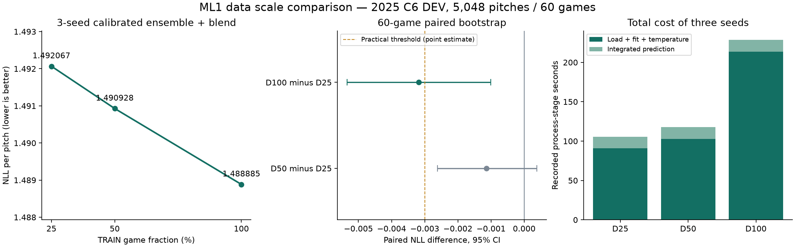
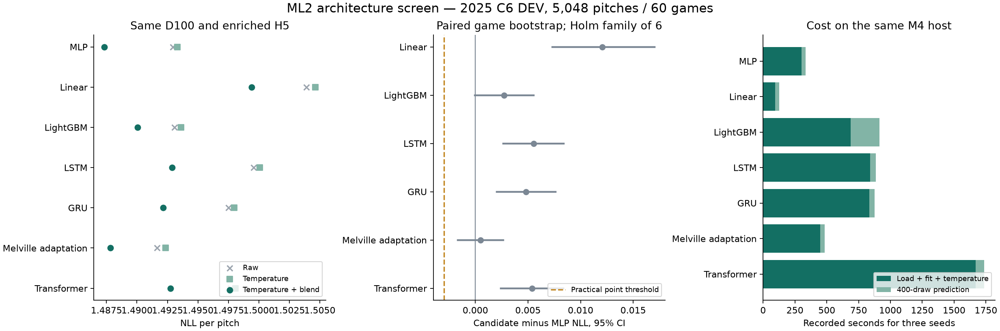
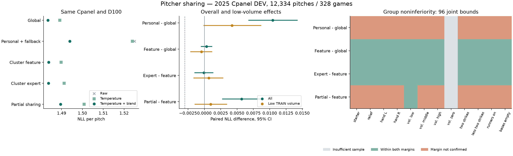
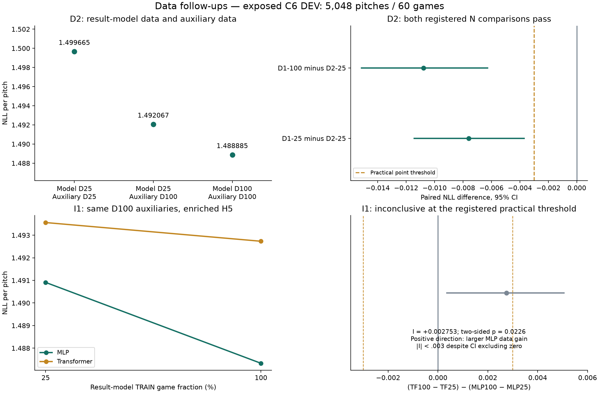

# ML 매트릭스 실행 보고서 — 진행 중

2026-09-24. 사용자가 승인한 전체 매트릭스를 단계별로 실행 중이다. 이 문서는 중간 기록이며, 아래 대기 행을 완료로 세지 않는다. 사전 설계의 60개 행은 조건부 후보와 외부 자료 의존 행을 포함한다.

- 실행 브랜치: `codex/ml-matrix-execution`. 산출물: `/Volumes/T7 Shield/pitcheezy/pitchmdp/runs/ML-MATRIX-20260924/`.
- 첫 등록: [EXP-P2-001](../../configs/EXP-P2-001.yaml), 구조 비교: [EXP-P3-001](../../configs/EXP-P3-001.yaml). [실행 계약](../contracts/ML-MATRIX-EXECUTION-v1.md)을 따른다.
- 논문 원래 과제·보고값·핵심 아이디어는 [문헌 검토](ML-literature-review-2026-09-24.md), 정책·RL 추가 방법론과 대응 대조군은 [전체 설계](../ML_EXPERIMENT_DESIGN.md)에 연결했다. 아래는 우리 공통 과제에 적응한 실행 결과다.
- 2026/최종셋 개발 금지. 원자료·가공 자료·캐시·동결 서비스 모델·사용자 서버/DB를 변경하지 않는다.
- 모든 새 fit/추론은 단일 heavy lock으로 실행한다. 요청 에이전트 모델은 단순 감사 Luna medium, 구현·실행 Sol medium, 복잡한 모델/누수·통계 검토 Astra high. backend 확정 모델·토큰·금액은 미측정이다.

## 현재 확인한 사실

1. 기존 보관 2024/2025 결과 감사 통과. 이는 이미 노출된 DEV 자료의 재계산이다.
2. 2023~2025 정규시즌 가공 자료 2,145,111구 및 물리 캐시 해시 일치. raw2023/2024는 추가 실제 읽기에서도 일치했으며 raw2025는 클라우드 읽기 시간초과로 현재 바이트를 확인하지 못했다.
3. 결과 모형 TRAIN은 D25 313,513구/1,168경기, D50 626,312구/2,336경기, D100 1,252,824구/4,671경기. 표본은 중첩되며 모든 seed에 동일하다.
4. 첫 attempt의 MLPseed42 fit 뒤 float32 적분 합 오차로 CAL 예측 저장이 중단됐다. 검사 문턱을 유지하고 float64 계산으로 수정했다. 실패 기록과 약26.5초 fit 비용을 보존했으며 fresh attempt2에서 재시작했다.
5. 실제 목표 위치 라벨과 미개봉 확인셋은 확보되지 않았다. 구종×목표 위치 최적 정책의 현실 효과는 아직 측정하지 않았다.

## 결과표

ML0 재현 완료: 같은 60경기·5,048구, 기존 5 seed 평균과 6월 빈도 혼합. 아래는 재현 점수이며 새 후보의 우위 검정이 아니다.

| 기준선 | NLL (낮을수록 좋음) | Brier 합 | 재현 |
|---|---:|---:|---|
| 빈도 | 1.505737330 | 0.725313243 | 기존 점수 정확 일치 |
| MLP 5-seed 혼합 | 1.491226056 | 0.721414090 | 통과 |
| Transformer 5-seed 혼합 | 1.490642329 | 0.721570118 | 통과 |

10개 신경망의 seed별 기존 대비 NLL 차이 절댓값 최대 **1.24265e-8**로 등록 허용폭 0.001 안이었다. 확률·키·라벨·분할·모델 해시 검사를 통과했다. 새로운 float64 적분 결과와 이전 float32 보관 예측의 수치 차이를 구분했다. 최고 메모리 약 **6.35 GB**(프로세스 RSS), 유효 재현 큐 **1,117.9초**: fit 997.7초, 적분 추론 120.1초. 준비/profile/첫 실패는 별도 비용이다.

재현 근거: `EXP-P2-001-v2/analysis/legacy/results.json`, 같은 폴더 `manifest.json`; 실행 기록 `audit/queue-v2/r2-queue-state.json`. 아래 D1 결과는 9개 fit+추론이 모두 끝난 뒤 NLL/Brier·경기 bootstrap CI·다중 비교·seed 방향·선수/클래스·비용을 함께 계산한 것이다.

### ML1 데이터량 비교 완료

| 학습 자료 | TRAIN 구 수 | NLL | Brier 합 | fit+보정 3개 합(초) | 적분 추론 3개 합(초) |
|---|---:|---:|---:|---:|---:|
| D25 | 313,513 | 1.492066969 | 0.721793194 | 90.95 | 14.49 |
| D50 | 626,312 | 1.490927872 | 0.721135073 | 102.98 | 14.63 |
| D100 | 1,252,824 | 1.488884727 | 0.720722194 | 213.76 | 14.93 |

동일 Fref/MLP/auxiliary/400draw/보정 절차/C6 60경기·5,048구를 사용했다. 비용 표는 로드·학습·보정을 포함한 프로세스 내부 기록이며 interpreter 시작·준비·profile은 제외한다. CLI 큐 전체는 **478.0초**, 최고 프로세스 RSS **8.36 GB**였다. 실제 epoch는 D25 [27,28,30], D50 [15,18,17], D100 [15,19,22]이며, 같은 최대epoch/early-stop 규칙이지 동일 optimizer update/시간 비교가 아니다.

| 주 비교(후보−D25) | ΔNLL | 경기 bootstrap 95% CI | Holm p | seed 방향 | 등록 판정 |
|---|---:|---|---:|---|---|
| D50 | −0.001139 | [−0.002611, +0.000383] | 0.06679 | 2/3 개선 | 우열 미확정 |
| D100 | **−0.003182** | **[−0.005346, −0.001011]** | **0.00420** | **3/3 개선** | **C6 예측 개선 N 통과** |

D100의 ΔBrier는 −0.001071, 95% CI [−0.002065, −0.000056]으로 guardrail을 통과했다. 실용 문턱 −.003은 점 추정치에 대한 등록 기준이며 신뢰구간 전체가 −.003보다 좋다는 뜻은 아니다. D100−D50의 ΔNLL −0.002043 [−0.003891, −0.000284]는 사전 지정 보조 진단이며 주 family 밖의 독립 성공으로 세지 않는다.

이 묶음에서는 **Bdata=D100**을 유지한다. 아직 C6 개발 예측 결과이며 불펜/새 선수/전체 MLB 강건성이나 추천 정책 가치를 입증하지 않았다. 근거는 `EXP-P2-001-v2/analysis/data/{results.json,manifest.json,predictions.npz}`이며 결과 그림의 provenance 파일이 해당 결과 해시를 연결한다.

### D2 결과 모형·보조 모델의 데이터 범위 분리 완료

D1은 결과 모형 학습량만 바꾸고 보조 적합은 D100으로 고정했다. D2는 D25와 같은1,168경기·313,513개 결과 학습 키를 유지하면서 선택되지 않은 TRAIN 경기 전체를 이력 원본에서 제거하고, 정규화·과거 이력·선수 context·빈도·delivery를 다시 적합했다. TRAIN 이전 및 그 후 시점의 합법적인 관측 이력은 두 조건에서 유지했다. 따라서 전체 원자료를 무조건25%로 줄인 실험은 아니다.

| 조건 | 결과 모델 TRAIN | 보조 적합 TRAIN | C6 NLL | Brier 합 |
|---|---|---|---:|---:|
| D2-25 | D25 | D25 경기만 | 1.499665376 | .724778571 |
| D1-25 재사용 | 같은 D25 | D100 | 1.492066969 | .721793194 |
| D1-100 재사용 | D100 | D100 | **1.488884727** | **.720722194** |

| 등록 비교 | ΔNLL (95% 경기 CI) | ΔBrier (95% CI) | Holm p | 판정 |
|---|---|---|---:|---|
| D1-100−D2-25 | −.010781 [−.015140,−.006273] | −.004056 [−.006391,−.001681] | .000200 | C6 예측 N 통과,3/3seed 개선 |
| D1-25−D2-25 | −.007598 [−.011422,−.003706] | −.002985 [−.004960,−.001060] | .000200 | C6 예측 N 통과,3/3seed 개선 |

같은 결과 학습 키에서도 보조 적합·이력에 더 많은 TRAIN을 쓰는 조건이 개선됐다. 이는 여러 보조 요소를 함께 바꾼 효과이며 특정 선수 통계나 delivery 한 요소의 기여로 나누지 않는다. D1에서 측정한 공통 D100 auxiliary 아래의 결과 모형 자료 증가 효과와도 구분한다. D1을 본 뒤 활성화한 노출 DEV 후속으로 독립 확인이 아니며 전체MLB·정책 효과는 미확인이다.

신규3fit/3predict 모두 성공, 준비/profile 포함 family **100.99초**, 가장 긴 fit+predict member33.97초였다. 앞서 비용 gate는 보수적 외삽4,683.4초로 통과했고 실제 소요가 더 짧았다. 근거는 `EXP-P6-001/analysis/{results.json,manifest.json,predictions.npz}`이며 결과 SHA256 `cbd8dfd5bc4e9fe726e60fd4d75d933aa865ba83e0fd093c24ba8d767526e11f`다. 새3개·보존6개를 모두 검증한 후 두 가설의 Holm family를 계산했다.

### ML2 구조 비교 완료

동일 D100·enriched H5·C6·400draw에서 7구조×3seed의 21개 구성원과 42개 fit/predict 명령을 모두 완료했다. 아래 주 점수는 각 seed의 5월 temperature 보정 후 확률 평균에 6월 빈도 혼합을 적용한 값이다. 결과 모형이 다를 때 보정 전후의 순위가 바뀔 수 있으므로 raw/temperature/최종 혼합을 함께 보존했다.

| 구조 | 주 NLL | Brier 합 | 후보−MLP ΔNLL (95% CI) | 등록 판정 | fit+보정 / 추론 3개 합(초) |
|---|---:|---:|---|---|---:|
| A0 MLP | **1.487329142** | **0.720487561** | 기준 | 기준선 유지 | 301.38 / 33.28 |
| A1 선형 | 1.499408093 | 0.724112580 | +.012079 [.007300, .017051] | 악화 또는 보호 기준 실패 | 95.09 / 32.09 |
| A2 LightGBM | 1.490040623 | 0.721627363 | +.002711 [−.000033, .005528] | 우열 미확정 | 686.20 / 227.61 |
| A3 LSTM | 1.492885425 | 0.721606887 | +.005556 [.002650, .008397] | 악화 또는 보호 기준 실패 | 839.19 / 45.02 |
| A4 GRU | 1.492146061 | 0.721372929 | +.004817 [.002032, .007630] | 악화 또는 보호 기준 실패 | 833.40 / 41.84 |
| A5 Melville 적응 | 1.487836166 | 0.720565056 | +.000507 [−.001677, .002668] | 우열 미확정 | 447.07 / 36.98 |
| A6 Transformer | 1.492732180 | 0.721635348 | +.005403 [.002402, .008354] | 악화 또는 보호 기준 실패 | 1668.27 / 67.09 |

6개 개선 검정의 Holm p는 모두1.0이며 N 통과 후보는 없다. 이는 모든 구조가 모든 조건에서 열등하다는 뜻이 아니다. 같은 고정 설정·정보·자료의 이번 개발 비교에서 MLP를 대체할 근거가 없다는 결론이다. Melville 적응은 raw NLL 1.491637로 raw MLP 1.492947보다 낮았지만 최종 주 점수 개선을 확인하지 못했다. 각 구조의 temperature 보정도 DEV에서 raw보다 조금 나빴다. 이를 보고 보정 기간이나 혼합 규칙을 다시 선택하지 않았다. 선형의 짧은 학습 시간을 품질 비열등까지 충족한 비용 개선 C로 판정하지 않는다.

전체 family의 누적 실행은 **5,467.2초**(약91.1분), 가장 긴 개별 fit은649.3초로 등록 gate 안이었다. 표의 비용은 로드·학습·보정 및 추론의 내부 기록이며 준비/profile/명령 시작 비용은 별도다. 최대 RSS는 LightGBM의 **11.24 GB**였다. `EXP-P3-001/analysis/{results.json,manifest.json,predictions.npz}` 및 그림 provenance가 근거다. D1과 입력 표현이 달라 A0와 D1-D100의 점수 차이를 구조 효과로 해석하지 않는다.

MLP를 다음 정보 공유·긴 이력의 공통 backbone으로 유지한다. 구조 성공 후보가 없어 구조 HPO·구조와 공유의 성공 요소 결합을 활성화하지 않는다. 사전에 필수로 정한 I1의 자료량×구조 상호작용은 그대로 실행한다.

### ML3 선수 공유·I2 집단 상호작용 완료

입력 명칭 명확화: 현재 G0에는 기본11채널 외에 타자 성향6·신뢰도6·soft membership5와 정적 투수 표현23·표본 수1이 들어간다. 순수 연속 성향만의 모델은 아니다. 이17개 타자 표현 묶음의 현재 Cpanel 기여는 별도 F1 bridge로 검증하며 G 결과에서 역산하지 않는다.

TRAIN에서 선정한48명, DEV328경기·12,334구의51개 고유 fit과15개 보정 예측을 모두 완료했다. TRAIN1,252,824구/early16,000구, temperature2,603구/blend4,821구는 모든 후보에 공통이다. 개인 적격11명에게만 개인 모델을 만들고 나머지37명은 fallback 경로로 평가에 유지했다. DEV 요청13,246구 중912구가 기존 사후 적격성 조건에서 제외됐으며, 지원률을 투구 전 가용성으로 해석하지 않는다.

| 방식 | NLL | Brier 합 | 등록 대조군 | ΔNLL (95% CI) | N/G 판정 | R |
|---|---:|---:|---|---|---|---|
| G0 전체 공유 | **1.483479107** | 0.723923891 | 기준 | 기준 | 공통 기준 유지 | 비교 없음 |
| G1 개인+fallback | 1.493936617 | 0.725840182 | G0 | +.010458 [.006793,.014205] | N 악화 / G 미확정 | 실패 |
| G2 군집 특성 | 1.483806316 | 0.723888107 | G0 | +.000327 [−.000484,.001137] | N/G 미확정 | 미확인 |
| G3 군집 전문가 | 1.483727247 | **0.723494678** | G2 | −.000079 [−.001448,.001299] | N/G 미확정 | 미확인 |
| G4 고정 부분 공유 | 1.489491236 | 0.724437485 | G2 | +.005685 [.002772,.008702] | N 악화 / G 미확정 | 실패 |

전체/저표본8개 NLL 검정의 Holm p는 모두1.0이다. 저표본 집단은3,160구/79경기이며 G1/G2/G3/G4의 대조군 대비 ΔNLL은 각각+.004220/−.000462/+.000665/+.000965로 등록 G 개선을 충족하지 못했다. G2/G3는 측정된11그룹 모두 R의 두 허용폭을 만족했지만 TRAIN0 선수 집단이 없어 전체 R은 미확인이다. G1은11개, G4는10개 측정 그룹에서 동시 상한 기준을 충족하지 못했다. 개별 상한 실패 자체와 실제 악화의 증명을 구분한다.

I2의 저표본−고표본 효과 차이는 G1 −.009630 [−.017026,−.002126], G2 −.000578 [−.002523,.001389], G3 −.000148 [−.003301,.002840], G4 −.008613 [−.013899,−.003227]이다. G1/G4의 음수는 고표본에서 상대 악화가 더 컸다는 관측 이질성이며, 저표본 개선이나 자료량 개입의 인과 효과가 아니다. 이 네 구간은 기술적 진단이고 별도 성공 검정으로 세지 않는다.

T1의 Cpanel 월별 진단도 완료했다. G3−G2 ΔNLL은7월−.001254,8월−.0000003,9월+.001442이고 각95%구간은0을 포함했다. 이 부호 변화만으로 drift나 최근 가중의 필요를 확정하지 않는다. 전체 MLB 월별은 T4에서 구간 추정·검정 없는 기술 통계로 보고했다(G3−G2 +.000658/+.000719/+.000831, **T4 전체 MLB 이전 평가 완료** 절).

실제 family 실행은 준비/profile 포함 **1,358.9초**(약22.6분), 가장 긴 명령315.7초였고 실패는0개다. 완전 family를 확인한 뒤 scorer15.0초를 별도로 실행했다. 재사용을 반영한 방식별 논리적 fit 비용은 G0/G1/G2/G3/G4 각각274.51/282.31/538.53/576.09/583.90초이며 공유 모델을 방식마다 다시 학습한 실제 비용으로 중복 합산하지 않는다. 근거는 `EXP-P4-001/analysis/panel/{results.json,manifest.json,predictions.npz}`와 `audit/queue-g-full/`이다.

N/G 통과 후보가 없어 승격은 없다. 사전에 정한 진단 규칙으로 G1~G4 중 가장 낮은 NLL의 **G3−G2**를 T2/T3/T4 및 구종 정책의 고정 비교쌍으로 골랐다. 결과를 보고 강한 전체 공유 기준선을 교체한 것이 아니다. T2/T3/T4는 `EXP-P7-001/002/003`, 정책 준비/profile은 `EXP-P8-001`에 등록했다. F4가 이후 선정되면 G 전용 일반화/정책 결과를 F4의 검증으로 대신하지 않는다.

### I1 자료량×모델 구조 상호작용 완료

D25에서 MLP/Transformer 각3seed를 새로 학습하고, 설정·표본·해시가 같은 ML2 D100의6개 구성원을 재사용했다. 동일 C6의60경기·5,048구, D100 auxiliary와 enrichedH5·400draw·5월 temperature/6월 빈도 혼합을 유지했다.

| 구조 | D25 NLL / Brier | D100 NLL / Brier | D100−D25 ΔNLL (95% CI, 보조 진단) |
|---|---|---|---|
| MLP | 1.490910192 / .721347650 | 1.487329142 / .720487561 | −.003581 [−.006282,−.000930] |
| Transformer | 1.493560322 / .721808656 | 1.492732180 / .721635348 | −.000828 [−.002019,+.000317] |

주 검정은 **I=(TF100−TF25)−(MLP100−MLP25)** 한 개다. I=**+.002752907**, 경기 bootstrap95% CI **[+.000362564,+.005052816]**, 양측 centered p=.02260이며3개 seed의 방향이 모두 양수였다. 다만 사전 실용 문턱 |I|≥.003을 충족하지 못해 **등록 판정은 미확정**이다. 양수 방향은 이번 설정에서 MLP의 자료량 증가 이득이 더 컸다는 뜻이다. Brier 상호작용+.000686783의 구간[−.000331995,+.001686601]은0을 포함했다. 보조 주효과·단순효과를 추가 성공으로 세지 않는다.

신규6fit/6predict 명령 모두 성공했고 준비 포함 실제 family 비용은 **759.6초**, 가장 긴 명령195.2초였다. scorer CLI1.8초는 별도다. 근거는 `EXP-P5-001/analysis/{results.json,manifest.json,predictions.npz}`이며 결과 SHA256은 `c34a3ef0ba1bbc01935aaa834cd5e51fbd2cd38639a494831d33127118b25008`이다. 공통 최대epoch·early-stop은 동일 시간/optimizer update 비교가 아니며, 상호작용은 보정·빈도 혼합까지 포함한 파이프라인 효과다. 이 결과만으로 Transformer의 자료 부족이나 더 큰 자료에서의 우위를 가정하지 않는다.

그림은 봉인된 `EXP-P6-001/analysis/results.json`(SHA256 `cbd8dfd5…6e11f`)과 `EXP-P5-001/analysis/results.json`(`c34a3ef0…b25008`)만 읽으며 provenance의 두 해시는 위 본문 해시와 일치한다. 두 family는 별도 bootstrap이고 입력 표현이 달라 D2와 I1의 절대 점수를 통제된 효과로 비교하지 않는다.

### T2 새 선수 일반화 완료

`EXP-P7-001`의 투수 축 G0-global 3seed와 타자 축 G3-cluster/G2-feature 3seed fit+predict를 모두 완료한 뒤 [T2 채점 규약](../contracts/ML-T2-SCORING-v1.md)대로 한 번 채점했다. 투수 제외 fold는 TRAIN에서 층별로 고른12명(DEV 요청2,494구 중 적격2,314구), 타자 제외 fold는186명(요청2,794구 중 적격2,606구)이며 두 선수의 두 번째 DEV 경기 뒤 행만 평가한다. 자연 새 대진은 두 선수 모두 TRAIN에 있고 대진은 DEV 전 자료에 없던 첫 DEV 경기로, 엄격한 zero-shot이 아니다. Z는 제외 선수 H5를 가리고, W는 같은 타석의 앞선 관측을 허용하며, O는 고정된 첫 두 경기 결과를 누적 context에 더한다. 비교쌍 G3-cluster(후보)−G2-feature(대조)는 부모 G의 **진단용 고정쌍(`diagnostic_only_not_promoted`)**이다.

| 주 가설 (Holm 6개) | 경기/구 | ΔNLL (95% 경기 CI) | ΔBrier (95% CI) | Holm p | seed 방향 | 등록 판정 |
|---|---:|---|---|---:|---|---|
| 1 자연 새 대진 G3−G2 | 244/5,436 | +.000384 [−.001737,+.002546] | +.000039 [−.000731,+.000834] | .6386 | 1/3 개선 | 우열 미확정 |
| 2 제외 타자 Z G3−G2 | 223/2,606 | **−.004418 [−.007436,−.001575]** | −.002274 [−.003225,−.001361] | **.0060** | 3/3 개선 | **예측 개선 N 통과** |
| 3 제외 타자 W G3−G2 | 223/2,606 | **−.004361 [−.007928,−.000830]** | −.001496 [−.002730,−.000275] | **.0294** | 3/3 개선 | **예측 개선 N 통과** |
| 4 제외 타자 O G3−G2 | 223/2,606 | **−.003743 [−.007185,−.000320]** | −.001375 [−.002570,−.000187] | **.0358** | 3/3 개선 | **예측 개선 N 통과** |
| 5 제외 투수 G0-global W−Z | 70/2,314 | −.017682 [−.025224,−.009984] | −.007734 [−.010786,−.004568] | .0006 | 3/3 개선 | 이력 적응 개선 |
| 6 제외 투수 G0-global O−Z | 70/2,314 | −.017681 [−.025221,−.009987] | −.007736 [−.010788,−.004568] | .0006 | 3/3 개선 | 이력 적응 개선 |

10,000회 경기 bootstrap(seed 20260924), 구 가중 평균, 6개 슬롯 Holm α .05다. 5·6은 같은 투수 모델의 이력 허용 차이이므로 `architecture_improvement_claim=false`이며 구조 개선으로 세지 않는다. 투수 O와 W는 거의 같았다. `predictions.npz`에서 O−W 주 확률의 최대 절대 차이는 .00155, W−Z는 .224였다. 규약상 O는 투수 profile/routing을 적응하지 않으므로 고정 2경기 노출 결과가 W 위에 준 추가 정보는 거의 없었다. 규약대로 보고만 하고 적응 방식이나 선수를 바꾸지 않는다.

| 셀별 주 NLL / Brier 합 | Z | W | O |
|---|---|---|---|
| 타자 G3-cluster | 1.502236 / .729145 | 1.487292 / .723728 | 1.486301 / .723147 |
| 타자 G2-feature | 1.506655 / .731419 | 1.491653 / .725224 | 1.490044 / .724522 |
| 투수 G0-global | 1.507608 / .732893 | 1.489926 / .725158 | 1.489927 / .725156 |
| 자연 새 대진 | G3 1.482094 / .721717 | G2 1.481710 / .721678 | — |

타자 모델 안의 W−Z/O−Z는 6개 가설 밖 기술 통계다. G3는 −.014944/−.015936, G2는 −.015002/−.016611이며 판정·승격에 쓰지 않는다.

Robustness는 자연·타자 Z/W/O의 4대비×12그룹×2손실=96개 동시 상한이다. 통과77, 측정 실패11, 결측8이다. 측정 실패는 모두 ΔBrier 상한(.002 허용폭)이다. 자연 새 대진은 불펜 .002446·우투 .002742·TRAIN 고표본 .003119·2스트라이크 .003754, 타자 W는 불펜 .002016·중표본 .002090·고표본 .002516·2스트라이크 .003294, 타자 O는 좌투 .002025·고표본 .002779·2스트라이크 .003346에서 실패해 세 대비는 `failed`다. 측정된 그룹의 ΔNLL 상한은 모두 .010 안이었다. 타자 Z는 측정 실패0이지만 TRAIN0(`volume_zero`) 그룹이 경기0·구0이라 `unconfirmed(structural: volume_zero)`다. 결측8은 네 대비의 `volume_zero` 두 손실이다. 이 fold들은 TRAIN 선수에서 고르므로 `volume_zero`는 설계상 채워질 수 없고, 따라서 후보/대조 대비는 이 family에서 confirmed에 도달할 수 없다. 이 구조적 한계를 그대로 기록하며 family를 재정규화하지 않는다. D61에 따라 이 결측은 다른 결측과 구분되는 구조적 결측으로 표기하고, 규약 ML-T2-SCORING-v1은 결과 열람 뒤이므로 고치지 않으며, zero-TRAIN 강건성은 온라인 TRAIN0 그룹이 실제로 있는 T4 전체 MLB에서 측정한다.

비용: 투수 fit `seconds_total` 85.56~95.03초. 타자 seed당 global 61.83~64.88, feature 64.63~69.58, cluster0 5.60~8.96, cluster1 17.47~23.43, cluster2 34.98~55.43초이며 fit 최고 RSS는 8.62~11.87GB였다. 타자 큐는 fit3개(208.03/214.28/214.74초 wall)와 predict6개(33.44~33.78초)가 모두 exit0으로 총838.65초였다(`audit/t2-batter/{queue-state.json,queue-summary.json}`). scorer는 2026-09-26T15:04:05Z~15:04:16Z, wall10.30초, exit0, 자식 최고 RSS0.49GB였다(`audit/t2-score/{score.log,score-exit.json}`).

해석 경계: G3-cluster는 부모 G에서 `diagnostic_only_not_promoted`이며 T2의 타자 제외 N 통과로 소급 승격하지 않는다. 이미 노출된 Cpanel DEV의 조건부 후속이며 독립 확인이 아니다(`independent_confirmation=null`). bootstrap 구간은 고정 예측에 조건부이며 학습·보정·선정 불확실성을 포함하지 않는다. `policy_effect=null`로 추천 정책 효과를 주장하지 않는다. 자연 새 대진에서는 우열이 나오지 않았으므로 타자 제외 결과를 새 대진 일반화로 넓히지 않는다. 이 채점으로 T2의 새 DEV 점수가 처음 열람됐다.

근거는 `EXP-P7-001/analysis/{results.json,manifest.json,predictions.npz}`이며 SHA256은 각각 `3fe958c3af7a1e251d615eb5c34c4702ebb172127e78908489b235338c7433aa`, `4bb0da8fcc58a4e568920b92aeea9a7ba72192190bd0819c1eddf8b8c856eeff`, `2b2c2314378300a8fbe2d431068280b03b73e8c25716834424cf62ff3e09a1f8`이다.

### T3 입력 stress 완료

`EXP-P7-002`는 [stress 판정 규약](../contracts/ML-STRESS-EXECUTION-v1.md)대로 Cpanel DEV 328경기·12,334구에서 부모 G의 **진단용 고정쌍 G3-cluster(후보)−G2-feature(대조)**(`diagnostic_only_not_promoted`)를 clean 포함 10시나리오×2모델×3seed=60회 재추론한 뒤 한 번 채점했다. 새 fit은 없고 May temperature·June blend를 그대로 재사용했으며 재보정은 없다(`no_recalibration=true`). clean 재추론의 최대 확률 오차는 seed0 gate에서 G3 5.66e-08·G2 0.0, 3seed 전체에서 G3 7.41e-08 이하, seed 평균+혼합 최종 확률에서 G3 2.31e-08·G2 0.0으로 1e-6 허용치 안이었다. 키와 delivery tier도 동일했다.

**상대 강건성(G3−G2, 전체 12,334구).** 상한은 200,000회 경기 bootstrap(seed 20260924)의 단측 동시 상한(각 α=.05/270)이다. 허용폭은 ΔNLL .010, ΔBrier .002다.

| 시나리오 | ΔNLL | NLL 상한 | ΔBrier | Brier 상한 | 측정 실패 그룹 (ΔBrier 상한) | seed ΔNLL 개선 |
|---|---:|---:|---:|---:|---|---|
| H2 | −.000707 | .001514 | −.000715 | .000097 | 없음 | 3/3 |
| H0 | −.001506 | .000566 | −.001076 | −.000324 | 없음 | 2/3 |
| mask20 | −.000680 | .001830 | −.000679 | .000232 | two_strikes .002035 | 3/3 |
| mask50 | −.000756 | .001576 | −.000784 | .000060 | two_strikes .002006 | 2/3 |
| unknown_type_outcome | −.000043 | .002652 | −.000245 | .000675 | two_strikes .002971 | 2/3 |
| sensor01 | −.000072 | .002477 | −.000402 | .000574 | two_strikes .002115 | 2/3 |
| sensor03 | −.000068 | .002574 | −.000428 | .000593 | two_strikes .002072 | 2/3 |
| unknown_pitcher | −.001203 | −.000534 | −.000668 | −.000392 | 없음 | 3/3 |
| unknown_batter | −.001574 | .000947 | −.001023 | .000068 | 없음 | 2/3 |

9개 시나리오 모두 전체 표본의 두 상한이 허용폭 안이고, 전체 표본의 후보 NLL이 모든 시나리오에서 대조군보다 낮았다. 13개 비교(전체+12그룹)의 ΔNLL 상한은 측정된 모든 그룹에서 .010 안이었다(최대 unknown_type_outcome two_strikes .009064). 측정 실패5개는 모두 two_strikes 그룹(3,690구/305경기)의 ΔBrier 상한이다. mask20/mask50은 허용폭을 각각 약3.5e-5/0.6e-5 넘어 극단 분위수의 Monte Carlo 오차에 민감한 구간이지만 규약대로 실패로 센다. 이 그룹의 점추정 ΔNLL은 다섯 시나리오 모두 양수였다(+.000337~+.002331). `volume_zero`는9개 시나리오 모두 경기0·구0으로 미측정이며 D61의 구조적 결측(`unconfirmed(structural: volume_zero)`)이다. 따라서 `relative_R`은 **failed**다.

**입력 안정성(시나리오−각 모델 clean, 전체 12,334구).**

| 시나리오 | G3 ΔNLL / 상한 | G3 ΔBrier / 상한 | G3 | G2 ΔNLL / 상한 | G2 ΔBrier / 상한 | G2 |
|---|---|---|---|---|---|---|
| H2 | +.001612 / .003590 | +.000764 / .001594 | 통과 | +.002240 / .004376 | +.001085 / .002031 | 실패(Brier) |
| H0 | +.015275 / .020729 | +.005734 / .007900 | 실패 | +.016702 / .022465 | +.006416 / .008757 | 실패 |
| mask20 | +.002667 / .005322 | +.001092 / .002161 | 실패(Brier) | +.003268 / .006115 | +.001377 / .002537 | 실패(Brier) |
| mask50 | +.006413 / .010043 | +.002512 / .003991 | 실패 | +.007090 / .011144 | +.002902 / .004574 | 실패 |
| unknown_type_outcome | +.003931 / .006666 | +.001569 / .002714 | 실패(Brier) | +.003896 / .006576 | +.001420 / .002560 | 실패(Brier) |
| sensor01 | +.000068 / .000300 | +.000032 / .000120 | 통과 | +.000060 / .000240 | +.000040 / .000117 | 통과 |
| sensor03 | +.000329 / .001029 | +.000139 / .000401 | 통과 | +.000318 / .000861 | +.000173 / .000412 | 통과 |
| unknown_pitcher | +.002811 / .006601 | +.001723 / .003350 | 실패(Brier) | +.003935 / .007821 | +.001998 / .003734 | 실패(Brier) |
| unknown_batter | +.008593 / .012590 | +.002842 / .004388 | 실패 | +.010088 / .014737 | +.003472 / .005194 | 실패 |

G3는 H2·sensor01·sensor03, G2는 sensor01·sensor03만 통과해 `within_model_stability`는 두 모델 모두 **failed**다. mask50 G3의 NLL 상한 .010043도 허용폭을 약4e-5 넘는다. 두 모델의 clean→stress 악화는 같은 방향이며 상대 비교와 별도 상태로 보고한다.

**270 상한 family.** `9 × ((전체+12그룹)+2모델) × 2지표 = 270`: 통과228, 측정 실패24(상대5·안정성19: NLL6·Brier13), 미측정18(`volume_zero` 9시나리오×2지표). 비교 단위135개로는 통과108·실패18(상대5·안정성13)·미측정9다. 규약 판정은 relative_R **failed**, stability G3 **failed**, G2 **failed**다.

| 절대 주 NLL / Brier 합 | G3-cluster | G2-feature |
|---|---|---|
| clean | 1.483727 / .723495 | 1.483806 / .723888 |
| H2 | 1.485339 / .724258 | 1.486046 / .724973 |
| H0 | 1.499002 / .729229 | 1.500509 / .730304 |
| mask20 | 1.486394 / .724587 | 1.487074 / .725266 |
| mask50 | 1.490140 / .726006 | 1.490896 / .726790 |
| unknown_type_outcome | 1.487659 / .725063 | 1.487702 / .725308 |
| sensor01 | 1.483795 / .723526 | 1.483866 / .723928 |
| sensor03 | 1.484057 / .723634 | 1.484125 / .724062 |
| unknown_pitcher | 1.486538 / .725218 | 1.487742 / .725886 |
| unknown_batter | 1.492321 / .726337 | 1.493894 / .727360 |

클래스별 값은 `results.json`의 `reports`에 있다. 클래스6은 DEV 지지 8사건으로 30사건 미만이라 클래스별 보고 부적격이다.

**실제 변경 비율.** 분모는 query-history occurrence 23,072개(고유 과거 구9,178개)이며 400회 delivery 반복은 넣지 않았다. H2 7,504개 drop(.3252, 고유4,068), H0 23,072개 전부 drop, mask20 4,644개(.2013, 고유1,863), mask50 11,505개(.4987, 고유4,603), unknown_type_outcome·sensor01·sensor03은 23,072개 전부 변경(drop0)이다. unknown_pitcher/unknown_batter는 이력 변경0이고 선수 context 누락(`context_outage`)으로 따로 표시했다. delivery tier는60개 산출물 모두 clean과 동일했다(0:4, 1:3,386, 2:2,753, 3:6,191).

**비용.** prepare 1.75초 → seed0 clean gate2회(40.14/39.99초 wall, G 실측 기반 사전 최대 추정10,873.5초) → 나머지58회 단일 큐2,361.0초(회당34.5~43.2초 wall, 내부33.4~42.1초, 최고 RSS6.73~6.83GB, 모두 exit0). scorer는 2026-09-26T16:05:13Z~16:06:29Z, 76.3초(자식 최고 RSS0.81GB, exit0)였다. 추론 family는2,442.9초로 예산28,800초의8.5%이며 scorer 포함2,519.2초다. 기록은 `audit/t3-stress/{cost-gate.json,queue-state*.json,queue-summary*.json}`, `audit/t3-score/score-exit.json`이다.

해석 경계: G3-cluster는 `diagnostic_only_not_promoted` 그대로이며 T3는 새로운 N 성공이나 독립 확인이 아니다(`policy_effect=null`, `whole_mlb_robustness=null`). bootstrap은 고정 예측 조건부로 학습·보정·선정 불확실성을 포함하지 않고, 극단 분위수에는 Monte Carlo 오차가 남는다. stress 강도는 가상의 고정 입력 오류이며 현장 센서 오차의 경험적 분포가 아니다. unknown_pitcher는 encoder/routing 특성만 가리고 delivery에는 기존 투수 ID를 유지한다. 상대 실패가 two_strikes의 ΔBrier에만 있고 상대 NLL 상한은 모두 통과했다는 것은 사실로 기록하되, 판정은 규약대로 failed이며 "사실상 통과"로 바꾸지 않는다. Cpanel의 zero-TRAIN 부재는 T4 전체 MLB에서 따로 측정한다.

근거는 `EXP-P7-002/analysis/{results.json,predictions.npz,manifest.json}`과 `EXP-P7-002/preparation.json`이며 SHA256은 각각 `3d4a790e1ce7f302eae5b3b26f8b2acda7f57e349533b3198e55f51cd3df52fc`, `c6bba80ec2edbae0e42016805bb0d243f166c6df346350869f590b96a664ddcf`, `41fa16edc6def1032b2e9312b24999041fdcdd21bcc321e96fe1090755b85e30`, `229691488cb31c90e6b3c3cc77a97216c6873d9001f00b2ac24a1f1f8ed82c8c`이다.

### T4 전체 MLB 이전 평가 완료

`EXP-P7-003`은 [전체 MLB 이전 규약](../contracts/ML-TRANSFER-EXECUTION-v1.md)대로 G의 TRAIN 선정48명 밖으로 평가 범위를 넓혀, 부모 G의 **진단용 고정쌍 G3-cluster(후보)−G2-feature(대조)**(`diagnostic_only_not_promoted`)를 2025 정규시즌 DEV 전체 MLB에서 2모델×3seed=6회 추론한 뒤 2026-09-27 01:58 KST에 한 번 채점했다. 적격311,721구/요청341,941구/1,161경기이며 ordered key hash(`afa9d8e3…36a516`)는 부모 `EXP-P4-001`의 `mlb_dev` 행 해시와 독립 재계산으로 일치했다. 새 fit은 없고 신경망·군집·선수 프로필·delivery400draw·Cpanel May temperature·June blend를 동결했으며 전체 MLB로 보정기를 재적합하지 않았다. 전체 MLB는 선정에 쓰인 Cpanel과 이미 노출된 2025 DEV를 포함하므로 독립 확인셋이 아니다.

| 주 가설 (Holm 2개) | 경기/구 | ΔNLL (95% 경기 CI) | ΔBrier (95% CI) | Holm p | seed ΔNLL | 등록 판정 |
|---|---:|---|---|---:|---|---|
| N 전체 MLB G3−G2 | 1,161/311,721 | +.000736 [+.000493,+.000978] | −.0000992 [−.000191,−.000007] | 1.0 | +.000792/+.000517/+.000736 (3/3 악화) | `worse_or_guardrail_failure` |
| G 저표본 TRAIN 투수 G3−G2 | 588/19,462 | +.001686 [+.000517,+.002872] | +.000299 [−.000117,+.000722] | 1.0 | +.001810/+.001944/+.000930 (3/3 악화) | G `inconclusive`(저표본 N 슬롯 `worse_or_guardrail_failure`, 전체 비열등 true) |

10,000회 경기 bootstrap(seed 20260924), 구 가중 평균, 2개 슬롯 Holm α .05다(보정 p 1.0/1.0). N은 실용 개선·CI·Holm·seed 방향을 모두 통과하지 못했고 Brier 비열등만 통과했다. 전체 ΔBrier는 95% CI가 0 아래(단측 p .0158)지만 주 판정은 NLL이며 Brier 개선을 새 성공으로 세지 않는다. G는 저표본 N 슬롯이 실패했고 전체 NLL/Brier 상한 기준(`whole_population_noninferior`)은 true여서 G 상태가 `inconclusive`로 기록됐다.

| 전체 MLB 주 지표 (311,721구) | NLL | Brier 합 | 정확도 | top-label ECE10 |
|---|---:|---:|---:|---:|
| G3-cluster | 1.491304 | .726472 | .372439 | .005377 |
| G2-feature | 1.490568 | .726571 | .371659 | .006710 |
| 빈도 기준선 | 1.504081 | .729481 | .371011 | .001660 |

두 모델 모두 빈도 기준선보다 NLL이 약 .013 낮다. 10개 클래스 모두 30사건 이상으로 클래스별 보고 적격이며 클래스별 값은 `results.json`의 `reports`에 있다. Cpanel 부분집합의 G3/G2 NLL(1.483727/1.483806)은 T3 clean 값과 같다.

**R 24 상한.** 12그룹×2지표, 100,000회 경기 bootstrap의 단측 Bonferroni 상한(각 α .05/24), 허용폭 ΔNLL .010·ΔBrier .002다. 12그룹 모두 30경기·500구 이상으로 측정됐고 24개 상한이 모두 허용폭 안이어서 R은 **passed**다. 최대 상한은 volume_low의 NLL .003394·Brier .000912다. `volume_zero`(온라인 TRAIN0 투수)는 28,746구/646경기로 실제 존재해 측정됐다. D61에서 T2/T3 Cpanel의 구조적 결측으로 남긴 zero-TRAIN 강건성을 이 그룹으로 측정한 것이며, 소급해서 T2/T3의 판정을 바꾸지 않는다.

| R 그룹 | 경기/구 | ΔNLL (95% CI) | NLL 상한 | ΔBrier | Brier 상한 |
|---|---:|---|---:|---:|---:|
| role_starter | 1,161/184,397 | +.000924 [+.000616,+.001233] | .001375 | −.000060 | .000117 |
| role_relief | 1,161/127,324 | +.000463 [+.000084,+.000844] | .001028 | −.000156 | .000060 |
| hand_L | 1,108/88,337 | +.000964 [+.000475,+.001458] | .001685 | −.000041 | .000247 |
| hand_R | 1,161/223,384 | +.000646 [+.000365,+.000928] | .001056 | −.000122 | .000037 |
| volume_low | 588/19,462 | +.001686 [+.000525,+.002849] | .003394 | +.000299 | .000912 |
| volume_middle | 1,151/108,351 | +.000083 [−.000333,+.000503] | .000697 | −.000374 | −.000135 |
| volume_high | 1,128/155,162 | +.001293 [+.000938,+.001647] | .001814 | +.000066 | .000269 |
| volume_zero (TRAIN0) | 646/28,746 | **−.000454 [−.000674,−.000243]** | −.000149 | −.000223 | −.000106 |
| two_strikes | 1,161/92,977 | +.001244 [+.000703,+.001788] | .002043 | +.000075 | .000388 |
| less_two_strikes | 1,161/218,744 | +.000520 [+.000265,+.000778] | .000897 | −.000173 | −.000030 |
| runners_on | 1,161/121,391 | +.001107 [+.000689,+.001526] | .001723 | −.000063 | .000150 |
| bases_empty | 1,161/190,330 | +.000499 [+.000204,+.000796] | .000929 | −.000123 | .000054 |

TRAIN0 그룹만 ΔNLL 95% CI 전체가 0 아래로 G3 개선 방향이었고 나머지 11그룹의 점추정은 모두 양수(G3 악화 방향)였다. R은 비열등 상한이며 이 그룹 개선은 등록된 주 가설이 아니므로 새 성공으로 세지 않는다.

**기술 통계(규약상 새 성공 선정에 쓰지 않음).**

| 부분집합 | 경기/구 | G3 NLL | G2 NLL | ΔNLL (G3−G2) | ΔBrier |
|---|---:|---:|---:|---:|---:|
| Cpanel | 328/12,334 | 1.483727 | 1.483806 | −.000079 | −.000393 |
| 비패널 | 1,161/299,387 | 1.491616 | 1.490846 | +.000770 | −.000087 |
| seen 투수 | 1,161/282,975 | 1.491227 | 1.490371 | +.000857 | −.000087 |
| unseen 투수 | 646/28,746 | 1.492055 | 1.492510 | −.000454 | −.000223 |
| seen 타자 | 1,161/289,312 | 1.492240 | 1.491467 | +.000773 | −.000089 |
| unseen 타자 | 850/22,409 | 1.479218 | 1.478958 | +.000260 | −.000233 |
| 2025-07 | 368/97,961 | 1.500173 | 1.499515 | +.000658 | −.000091 |
| 2025-08 | 420/113,592 | 1.489950 | 1.489231 | +.000719 | −.000107 |
| 2025-09 | 373/100,168 | 1.484165 | 1.483333 | +.000831 | −.000098 |
| 투수 722명 동일가중 macro | — | 1.503653 | 1.502943 | +.000710 | −.000138 |

월별 G3 악화 폭은 7→8→9월로 커지는 방향이었지만 구간 추정이 없는 기술 통계다. 부분집합 ΔNLL은 두 모델 NLL의 차이로 계산했다.

**경로 범위.** 개인 모형 적격 후보48명 중 실제 개인 모형이 있는 투수는11명이고 나머지는 동결 league/cluster 경로로 돌아간다(전체 MLB 개인화 모형을 새로 학습한 것이 아니다). 군집 전문가는 k=4이며 TRAIN 투수1,137명에서 만든 동결 군집이다. delivery tier는 6개 산출물 모두 {−1:34, 0:276, 1:83,480, 2:70,244, 3:157,687}으로 같았고 −1은 전역 fallback이다. 새 선수의 과거 DEV 이력은 기존 context 규칙대로 온라인 반영되므로 TRAIN0·unseen 그룹은 T2의 엄격한 선수 제외 zero-shot과 다르다.

**비용.** prepare 1.34초(2026-09-26T16:11:14Z) → 사전 추정(G panel 실측 외삽 member당 최대1,092.3초, family 6,553.6초)으로 gate 진행 → G3 seed0 gate 444.86초 wall(내부442.36초, 최고 RSS6.69GB) → 나머지5회 단일 큐2,233.14초(회당441.1~452.5초 wall) → scorer 27.76초 wall(내부19.20초, 자식 최고 RSS1.44GB, exit0, 16:58:01~16:58:29Z)였다. 6회 내부 runtime은438.5~450.0초, 최고 RSS6.69~6.72GB로 모두 exit0이다. 큐 총합2,679.35초로 예산28,800초의9.3%이며 scorer 포함2,707.1초다. 기록은 `audit/t4-transfer/{cost-gate.json,queue-state*.json,queue-summary*.json}`, `audit/t4-score/score-exit.json`이다.

**규약 이탈·이상 2건.**
1. `cost-gate.json`의 첫 작성 시도가 JSON 형식 읽기 오류로 쓰기 전에 중단됐고, gate 멤버(G3 seed0)는 같은 셸 명령에서 16:12:00Z에 이미 시작됐다. 같은 입력으로 계산한 추정을 16:12:23Z(gate 시작 약23초 뒤)에 다시 썼으며 판단은 변하지 않았고 성능은 열지 않았다. 파일의 `deviation_note`에 기록돼 있다.
2. 등록된 코드 경로(`run_ml_transfer.predict → run_ml_sharing.predict(mlb=True)`)가 부모 `EXP-P4-001/members/{G3-cluster,G2-feature}/seed{0,1,2}/`에 `mlb_predictions.npz`·`mlb_prediction_runtime.json`·`mlb_prediction_state.json`을 새로 만들었다. 기존 부모 파일은 변경되지 않았고 T4 이후 수정된 부모 member 파일은 이 `mlb_*` 파일뿐이다. 부모 run 디렉터리에 자식 산출물이 생긴 것은 기록해 두며 삭제하지 않는다.

해석 경계: G3-cluster는 `diagnostic_only_not_promoted` 그대로이며 T4는 독립 확인이 아니고(`independent_confirmation=null`) 정책 효과도 아니다(`policy_effect=null`). 전체 MLB에서는 G3가 G2보다 NLL이 미세하게 나빴고(+.000736, 3/3seed), 학습에서 본 적 없는 투수(TRAIN0/unseen 투수28,746구)에서만 개선 방향이었다. T2의 제외 타자 개선과 함께 "새 선수 쪽에서만 군집 전문가 이득이 있을 수 있다"는 것은 **가설 수준의 기술 관찰**이며 새 성공이나 후보 변경의 근거로 세지 않는다. unseen 타자는 +.000260으로 같은 방향이 아니었다. bootstrap은 고정 예측 조건부로 학습·보정·선정 불확실성을 포함하지 않고, 사후 적격성은 투구 전 가용성과 다르다(`limits`).

근거는 `EXP-P7-003/analysis/{results.json,predictions.npz,manifest.json}`과 `EXP-P7-003/preparation.json`이며 SHA256은 각각 `dfbdd919f63e5c16281d590e5fd121fff7f102c9526fe6bf6795d5ab59ad5932`, `3f8a197c553e094697fdbd5e2cb78b34ba372dab3a9f1766a6be35828d823a0a`, `0861844143093ca7643ff7d67f46829ee08cef7154ad47f37ddd85249c207d58`, `21986d47c9d39d79bb2cb268659eb78eecdcb87ce57cdf9be6a62d2bf10f49f3`이다.

### P0~P3 구종 정책 실행 완료(모델 내부)

`EXP-P8-001`은 [정책 실행 등록](../contracts/ML-POLICY-EXECUTION-REGISTRATION-v1.md)과 [러너 규약](../contracts/ML-POLICY-RUNNER-v1.md)대로 G3-cluster(계획, `diagnostic_only_not_promoted`)가 만든 Q^BC 정책을 G2-feature 공통 평가기(control 세계)에서 비교했다. 실행 config `configs/EXP-P8-001-execution.json`(SHA256 `3ddedac1…c446ed75`, 커밋 a2a7528, 2026-09-27 00:27 KST)은 June 값을 열기 전에 커밋됐고, 모든 stage의 실행 hash는 `7f8fe129…4ec2c48c`로 같다. 2026-09-27 02:01~02:06 KST에 p0 → blend-control → dev-control → dev-candidate를 단일 큐로 실행해 모두 exit0이었고, 이어 하위집단 기술 보고 3개를 만들었다(02:07 KST). evaluation rollout 4, search rollout 2, cap 8/8, planning seed 701, evaluation seed 1701, 경기 bootstrap 10,000회(seed 20260924)다. 새 WE·결과·delivery fit은 없고 TRAIN BC는 준비 단계에서만 적합했다.

**비용.** 모든 stage가 stage 예산(조건부 460,000행·1,500초)과 외부 wall(stage 7,200초) 안에서 끝났다.

| stage | 큐 wall 초 | 내부 runtime 초 | 조건부 rows | seed wrapper rows | prediction calls | 자식 최고 RSS |
|---|---:|---:|---:|---:|---:|---:|
| p0 | 4.02 | 0.68 | — | — | — | 0.92 GB |
| blend-control | 114.49 | 112.04 | 106,284 | 318,852 | 18,143 | 1.01 GB |
| dev-control | 88.38 | 85.34 | 71,408 | 214,224 | 13,049 | 1.02 GB |
| dev-candidate | 86.39 | 83.21 | 71,995 | 215,985 | 13,229 | 1.02 GB |
| 합계 | 293.31 | | 249,687 | | 44,421 | |

stage 예산 대비 최대 사용은 blend-control의 rows 23.1%(106,284/460,000)와 내부 초 7.5%(112.04/1,500)다. 등록 외삽(×2 전) 대비로는 blend-control rows 46.4%(/228,990)·내부 초 15.0%(/744.9), dev-control 52.7%(/135,457)·19.2%(/443.7)였다. 신경망 subnetwork rows는 blend candidate 571,398/control 66,306, dev-control 384,618/43,830, dev-candidate 431,970/0이다. policy-run 3개 wall 합은 289.26초로 family 14,400초의 2.0%다. 기록은 `audit/p8-policy/{queue-state.json,queue-summary.json}`과 각 stage `runtime.json`이다.

**P0 행동 모형(BC) 검증.** 요청 Cpanel 투구 전부를 분모에 남겼고 unknown pitcher fallback은 0이다. 미지원 관측 라벨이 있어 full-request NLL은 규약대로 null이며, 아래 NLL은 같은 지원 라벨 부분집합의 조건부 값이다.

| 구간 | 요청 투구 | 지원 라벨/미지원 | BC NLL | 빈도 NLL | top-1 일치 BC/빈도 (참고) |
|---|---:|---:|---:|---:|---:|
| June blend | 5,212 | 5,196/16 | 1.353548 | 1.456130 | 42.59% / 38.93% |
| DEV (7~9월) | 13,246 | 13,187/59 | 1.370029 | 1.441127 | 42.28% / 40.52% |

BC는 두 구간 모두 빈도보다 조건부 NLL이 낮다(DEV −.071). top-1 일치는 러너 지표가 아니다. DEV 값은 실행 에이전트가 `stages/p0/dev.npz`에서 별도로 계산했고 기록 담당이 같은 파일로 다시 계산해 일치를 확인했다(분모는 요청 투구 전체, 미지원 라벨은 불일치로 셈). blend 값은 기록 담당의 재계산이다. 규약상 일치율을 가치 개선으로 판정하지 않는다(MX-P0).

**June τ 선정(blend control 세계).** 요청 1,338타석 중 선택 128, 지원 120타석/77경기(사후 미지원 8, 교체 없음)다. 평균 수비 WE(원래·벌점 없음)는 다음과 같다.

| 정책 | 평균 WE | −P0 (paired MC SE) |
|---|---:|---|
| P0 | .478884 | — |
| P2 | .476325 | −.002559 (.002886) |
| P3 τ .001 | .472977 | −.005906 (.002540) |
| **P3 τ .003** | **.474604** | −.004279 (.002449) |
| P3 τ .01 | .474089 | −.004794 (.002473) |
| P3 τ .03 | .473854 | −.005030 (.002410) |

등록 규칙(평균 WE 최대, 동률이면 큰 τ)으로 **τ = .003**을 골랐고 RL 비교기는 P2(.476325 > P3 .474604)다. `stages/tuning_freeze.json`(SHA256 `fb0b8b22…7ae7fece`)이 June 결과 hash `83e6e85e…811a1167`, manifest hash, 실행 hash, τ, 비교기를 고정하며 두 DEV 세계가 같은 의존성을 썼다. June 값은 τ·비교기 선정에만 쓰고 판정에 쓰지 않는다.

**DEV 주 family(control 세계, Holm 3개).** 요청 3,357타석 중 선택 128, 지원 117타석/91경기(사후 미지원 11)로 최소 조건(30경기·50타석)을 충족해 추론 적격(`reporting_eligible`)이다. 평균 WE는 P0 .465391, P1 .463391, P2 .458077, P3 .465056이다.

| 비교 | ΔWE (95% 경기 CI) | 단측 p | 대체값 Holm | worst-case 평균 (95% CI) | 결합 Holm | 예비 screen | 등록 판정 |
|---|---|---:|---:|---|---:|---|---|
| P1−P0 | −.002000 [−.005113,+.001105] | .9017 | 1.0 | −.010245 [−.019474,−.002821] | 1.0 | false | `inconclusive` |
| P2−P1 | −.005315 [−.011462,−.000144] | .9595 | 1.0 | −.012000 [−.020121,−.005012] | 1.0 | false | `inconclusive` |
| P3−P2 | **+.006980 [+.001754,+.013207]** | .0147 | **.0441** | −.005645 [−.016143,+.004594] | 1.0 | **true** | `tail_assumption_dependent` |

paired MC SE는 P1−P0 .001699, P2−P1 .002703, P3−P2 .002616이다. P3−P2만 예비 모델 내부 screen(평균 ≥.0001, CI 하한>0, 대체값 Holm ≤.05)을 통과했다. 같은 경기 resample의 worst-case 평균이 음수이고 CI가 0을 포함하며 결합 p .8623의 Holm이 1.0이어서 **강한 모델 내부 주장은 실패**했다(`untruncated_pa_improvement_confirmed=false`). 이 screen은 잘린 궤적의 꼬리 가정(시작 상태 WE 고정)에 의존하는 예비 결과다. 또한 P3는 P0보다 −.000335(MC SE .002206) 낮아 **BC 대비 개선이 아니다**. P3−P2의 통과는 P2가 P0보다 −.007314(MC SE .002758) 낮았던 데서 회복한 폭이다.

**DEV candidate 세계(민감도, 두 번째 성공 기회 아님).** 같은 117타석/91경기, 평균 WE P0 .463062, P1 .463461, P2 .460843, P3 .463184.

| 비교 | ΔWE (95% 경기 CI) | 단측 p | 대체값 Holm | worst-case 평균 | screen | 판정 |
|---|---|---:|---:|---:|---|---|
| P1−P0 | +.000399 [−.002321,+.002970] | .3895 | .7789 | −.016880 | false | `inconclusive` |
| P2−P1 | −.002618 [−.007984,+.002206] | .8442 | .8442 | −.010244 | false | `inconclusive` |
| P3−P2 | +.002341 [−.001974,+.007355] | .1631 | .4893 | −.011109 | false | `inconclusive` |

세 비교 모두 결합 Holm 1.0이다. P2−P0은 control −.007314, candidate −.002219로 계획한 모델 자신이 평가하는 세계에서 하락 폭이 작았다. 이는 MX-P8(모델 이용 취약성) 검토에 쓸 수 있는 기술 관찰이며 여기서 판정하지 않는다.

**rollout 절단(cap 8).** 정책별 절단 비율은 blend .417~1.042%(P0/P2/τ.001/τ.003 .625%, τ.01 .417%, τ.03 1.042%), DEV control .641~1.068%(P0 .855%, P1·P2 1.068%, P3 .641%), DEV candidate .855~1.709%(P0 1.496%, P1 1.709%, P2 .855%, P3 1.068%)다. 절단 궤적은 시작 상태 WE로 대체하고 [0,1] worst-case 경계를 함께 보고했다.

**하위집단(기술 통계, [규약](../contracts/ML-POLICY-SUBGROUP-REPORT-v1.md)상 새 검정·승격 없음).** TRAIN 역할은 고정 선수 분류이며 각 경기의 실제 등판 역할이 아니다.

| 그룹 | P0 DEV 투구/경기 | BC NLL | 빈도 NLL | control 타석/경기 | control P1−P0 / P2−P1 / P3−P2 | candidate P3−P2 |
|---|---:|---:|---:|---:|---|---:|
| relief | 4,203/243 | 1.2505 | 1.3228 | 57/50 | −.00224 / −.00505 / +.00839 | +.00580 |
| starter | 9,043/117 | 1.4255 | 1.4960 | 60/43 | −.00177 / −.00556 / +.00564 | −.00094 |

blend P0는 relief 1,396구 BC 1.3911, starter 3,816구 BC 1.3399다. 투수별 그룹(blend 20명, DEV 24명)은 각 `results.json`에만 둔다. 작은 그룹의 방향 차이는 해석하지 않는다.

**규약 이탈 1건.** 등록 문서의 family wall 상한 14,400초를 policy-run 3개에만 적용했고 p0-evaluate는 별도 1,800초 상한으로 돌렸다(p0 실제 4.02초). 결과·판정에는 영향이 없다. stage 예산이 aggregate가 아니라 stage당이라는 점은 실행 전 총괄 결정에 이미 기록했다.

해석 경계: 모든 값은 G2 시뮬레이터 안의 **모델 내부 평가**이며(`model_internal_only=true`, `evaluator_independent_data=false`) 관측 OPE·인과 효과·정책 채택은 null이다. MX-P 판정표의 `모델 내부` 칸에만 해당하고 `관측 OPE`·`전향적 실제 적용`은 비어 있다. 계획 모델 G3는 `diagnostic_only_not_promoted` 그대로다. bootstrap은 모델·보정·선택을 고정한 시작 상태 변동이며 MC SE는 별도 기술 통계다. 지원 판정은 사후 기준이고, 117타석/91경기 표본이라 검정력이 제한된다. planning seed 불확실성은 포함하지 않는다.

근거 SHA256: `stages/p0/results.json` `bb2bdf4a245c9432cf07d9e967e914b39338dcd27b57566cfb45c36d9d12bbf5`, `stages/blend-control/results.json` `83e6e85ebede54e840b25d5f89e007ba1ec888ffce8ac8a948f63974811a1167`, `stages/dev-control/results.json` `6e80349a79288268213843327fdb0ab79d6f4bc8eaf2e3e7268c440d5cfaa9a9`, `stages/dev-candidate/results.json` `12b6cdf823cc39a36819ae746bf6837bf48c462e9d2ac2f0c9db921fe4663248`, `stages/tuning_freeze.json` `fb0b8b222f401e385cae152be1c0371f0784a18e616dbfd423f7f1bd7ae7fece`, 하위집단 `audit/p8-policy/groups-p0/results.json` `bc535aa88ba4578cd5c523b4eac6985a7062337638c13a85712dfb2e73d28559`, `groups-dev-control/results.json` `77686afe3c9b9240bb3453374ca187526abb9ffe9aa5c9ec69d264dca116ec60`, `groups-dev-candidate/results.json` `febc6633e9c9f042678461a61cfd57198da7f04b58b2d074f2ebc68f286d8ac0`이다(`EXP-P8-001/` 기준 상대 경로, 하위집단은 `ML-MATRIX-20260924/` 기준).

### 후속 실행 준비와 비용 확인

F4의3arm×3seed와 I1의신규6fit은 각각 [긴 이력 규약](../contracts/ML-LONG-HISTORY-EXECUTION-v1.md), `configs/EXP-P4-002.yaml`/`EXP-P5-001.yaml`에 등록했다. T2/T3/T4에는 [선수 제외·입력 오류 규약](../contracts/ML-T2-T3-PROTOCOL.md), [stress 판정](../contracts/ML-STRESS-EXECUTION-v1.md), [전체 MLB 이전·후속 선택 규칙](../contracts/ML-TRANSFER-EXECUTION-v1.md)을 마련했다. 코드/synthetic 검사 준비와 실제 실험 완료는 구분한다.

T3 `EXP-P7-002`는 2026-09-27 00:22~01:06 KST에 prepare(1.75초)·seed0 clean gate·나머지58회 추론(2,361.0초)과 scorer(76.3초)를 모두 exit0으로 마쳐 **완료**했고 결과는 위 **T3 입력 stress 완료** 절에 기록했다. T4 `EXP-P7-003`은 2026-09-27 01:11~01:58 KST에 prepare(1.34초)·G3 seed0 gate(444.86초)·나머지5회 추론(2,233.14초)과 scorer(27.76초)를 모두 exit0으로 마쳐 **완료**했고(큐 총2,679.35초, 예산의9.3%) 결과는 위 **T4 전체 MLB 이전 평가 완료** 절에 기록했다. P8 `EXP-P8-001` 정책 실행은 2026-09-27 02:01~02:06 KST에 p0(4.02초)·blend-control(114.49초)·dev-control(88.38초)·dev-candidate(86.39초)를 모두 exit0으로 마쳐 **완료**했고(큐 총293.31초, 최고 RSS1.02GB) 결과는 위 **P0~P3 구종 정책 실행 완료(모델 내부)** 절에 기록했다. 후속 offline RL(IQL/CQL, MX-P4/P5)은 **준비/profile 실행 중**(`audit/rl-prepare-profile/`)이며 결과는 아직 없다.

F4 첫 준비는 약4.8초에 중단됐다. 한 타석에 두 타자 ID가 있는47타석/248구를 long-history 구현이 거부했으며 profile/fit/점수는 생성되지 않았다. 정규시즌 전체2,145,111구의 키 감사에서 이 행들은 frozen G의 TRAIN/early/temperature/blend/DEV/전체MLB query에 하나도 포함되지 않았다. 분할별 원본 수는 TRAIN33타석/173구, early1/4, temperature0, blend2/11, DEV9/48, 미사용2/12다. 실패 attempt와 `audit/f4-profiles/ambiguity.json`을 보존했다. 별도 긴 이력에서만 이러한 완료된 과거 타석을 제외하고 모든 base/H5/query 행과 고정 auxiliary를 유지하는 수정이 독립 검토와10개 합성 검사를 통과했다. [fresh attempt2](../../configs/EXP-P4-002-v2.yaml)의 준비와3개 실제 profile도 완료했고 모든 공통 분할 키가 G와 정확히 일치했다. 현재 지원 여부나 결과를 보고 과거 이력을 제거하는 규칙은 사용하지 않는다.

다만 F4의 작은 cold profile은 H0/H32/H128의 전체 member 비용을9,973/9,394/9,581초로 외삽해 개별7,200초 gate를 모두 넘었다. 실제 작은 fit은3.65~3.89초, 최고 RSS6.80GB이며 아직 full fit은0개다. 동일 이력의400회 반복 인코딩을 줄이는 최적화는 소스/합성 검토와 **세 arm 실제 MPS 동일 가중치 검증을 통과**했다. 주요 logits/확률/temperature 차이는0이었고, 순서·chunk 크기를 바꾼 추가 probe의 최대 logit 차이4.7684e-7/확률 차이4.2059e-8도 원래 허용치 안이었다. 이는 등록된 May 입력에 한정한 수치 검사이며 보편적 동등성이나 품질 개선 증거가 아니다. 검증 비용39.176534초에는 첫 summarize 실패와 retry를 포함한다. 실패 원인은 외장 SSD의 미등록 AppleDouble 메타데이터3개였으며 magic·해시·크기를 기록해 별도 보존하고 등록된 모든 파일은 유지한 채 summary를 완료했다. 근거는 `EXP-P4-002-equivalence/summary/manifest.json`(SHA256 `5ebf6a14805ab433ae3ed2b72deb8827331b876bc153304f6fbf9a1af6fda912`)이다.

독립 검토17개/통합13개 합성 검사를 통과한 [비용 측정 개정](../contracts/ML-LONG-RESOURCE-PROFILE-v2.md)을 채택하고 [fresh attempt3](../../configs/EXP-P4-002-v3.yaml)에 등록했다. TRAIN8192구 warmup을 버리고 새 모델의65,536구×4epoch를 측정하며, 전체30epoch·member별 초기화와2회 로드·전체 보정/추론을 보수적으로 외삽한다. 모든3profile, 개별7,200초 및 기존 실패·준비·검증을 포함한9member 전체28,800초 예산을 다시 통과해야 fullfit을 시작한다. 모델·전체 학습량·seed·400draw를 줄이지 않는다.

v3 준비(6.06초)와3개 warm profile(50.63/51.22/52.55초)을 완료했다. member별 보수적 외삽(로드2회·fit30epoch·temperature·blend/DEV 추론)은 H0/H32/H128 각각6,858.1/6,934.2/7,137.0초로 개별7,200초 안이며 최고 RSS는6.79/6.76/6.80GB였다. 그러나 이 값을3seed로 합한9member 외삽만**62,787.8초**로28,800초 전체 예산을 넘는다(기존 실패·준비·검증 비용 미포함). 따라서 fullfit은0개로 **보류**한다. 모델·자료·seed·400draw를 줄여 예산에 맞추지 않는다. 근거는 `EXP-P4-002-v3/profiles/{F4-H0,F4-32,F4-128}/profile.json`의 `projection.load_fit_temperature_prediction_seconds`와 `audit/f4-v3-profiles/queue-state.json`이다.

D2는 신규3fit/보존6fit 검증과 두 주 비교를 완료했고 위에 결과를 기록했다. T2는 정제된 TRAIN 이력의 실제 선수 표본 수와 자연 발생 새 대진 metadata까지 고정하는 [6개 주 비교 규약](../contracts/ML-T2-SCORING-v1.md)을 추가했다.

T2 `EXP-P7-001`은 준비17.31초와 투수/타자 TRAIN-only profile7.67/8.75초를 마쳤다(`audit/t2-profiles/queue-state.json`). profile의 seed당 fit 외삽은 투수1,213.8초, 타자2,763.4초였다. **투수 축** G0-global fallback3seed의 fit+predict를 완료했다. seed0/1/2의 fit 내부 시간은89.22/95.03/85.56초, 최고 RSS11.07/11.87/11.76GB, predict는24.85/24.68/24.69초와11.95/12.03/11.97GB였다. 큐 누적406.52초, 실패0이다(`audit/t2-full/queue-state.json`, `EXP-P7-001/pitcher/fits/seed{S}/global/fit.json`, `members/G0-global/seed{S}/runtime.json`). **타자 축**은2026-09-26 23:48 KST에 단일 큐로 시작해 fit3개·G3-cluster/G2-feature predict6개가 모두 exit0으로 끝났다(총838.65초, `audit/t2-batter/`). 2026-09-24 `audit/t2-full/fit-batter-0.log`는 빈 파일이고 queue-state 기록이 없어 완료로 세지 않는다. 이어 scorer를 한 번 실행해(wall10.30초, exit0) T2를 완료했고 결과는 위 **T2 새 선수 일반화 완료** 절에 기록했다. 채점 전 predict runtime의 `new_DEV_scores_read=false`는 채점 이전 상태이며, 이제 새 DEV 점수는 열람됐다.

P0~P3 구종 정책 실행기는 구현·synthetic 감사를 마쳤고 `EXP-P8-001`의 준비187.90초와 May16-31 temperature4시작 profile(내부4.83초, 최고 RSS0.98GB, 조건부1,501행, `quality_scores_read=false`)을 완료했다. 고정 예산으로 고른 시작 타석은 temperature4/729, blend128/1,338(지원120), DEV128/3,357(지원117)이다(`audit/p8-preparation-profile/queue-state.json`, `EXP-P8-001/stages/profile/result.json`). 당시 정책 실행은0개였고 최종 실행 예산은 별도로 고정했다. 이후 정책 실행을 완료했다(`audit/p8-policy/`, 위 절). 기존 WE/진루 모델의 학습 기간은 2025-04-30까지이며 실제 사용 전 동결 artifact 해시를 재검사했다. 최소30경기·50타석 시작 조건과 rollout 중단의 최악 경우를 반영한 paired CI/검정을 보강했다. IQL/CQL은 사용자의 강화학습 비교 요청과 rollout 비용을 근거로 활성화했다. [오프라인 RL 실행기](../contracts/ML-OFFLINE-RL-RUNNER-v1.md)는 같은 입력의 neural BC·IQL·CQL 각3seed, 공통 수비 WE 보상, TRAIN 비용 profile 및 4개 공동 주 비교를 구현했다. 관련 합성60검사+8subtest를 통과했다. 이 문단 작성 당시 실제 RL 준비/profile/학습은 시작하지 않았고, 현재 RL 준비/profile이 실행 중이다(`audit/rl-prepare-profile/`, 실제 학습 전).

## 전체 60개 행 상태

| 행 | 우선순위 | 현재 상태 | 근거·진행 조건 |
|---|---|---|---|
| MX-R0 | 필수 | 첫 묶음 감사 완료·패널 범위 확장 준비 | 현재 가공/캐시 해시 검증, raw2023/24 검증; raw2025 클라우드 읽기 시간초과, ingestion 재현 미확인 |
| MX-R1 | 필수 | 기존 2024/25 산출물 감사 통과 | 보관 예측·체크포인트·표본·보정·지표 해시 감사; 새 학습과 구분 |
| MX-R2 | 필수 | 재현 통과 | 빈도+MLP/Transformer seeds42–46의 완전 family 검증; 최대 seed NLL 차이 1.24e-8 |
| MX-D1 | **첫 비교** | 완료: D100 N 통과, D50 미확정 | 9개 fit+추론 완료; D100−D25 ΔNLL−.003182, CI[−.005346,−.001011], Holm.00420 |
| MX-D2 | 후속 | 완료·두 비교 N 통과 | D1-100/D1-25−D2-25 ΔNLL−.010781/−.007598, 각각Holm.000200; 공동auxiliary 개입/노출DEV |
| MX-D3 | 후속 | 검토 완료·미활성화 | Cpanel T1 월별 구간 모두0 포함, T4 월별은 구간 없는 기술 통계; 기준선의 시간 방향 악화 근거 없음([활성화 검토](ML-followup-activation-review-2026-09-27.md)) |
| MX-D4 | 후속 | 검토 완료·미활성화 | D3와 같은 근거; half-life 튜닝 미시작([활성화 검토](ML-followup-activation-review-2026-09-27.md)) |
| MX-D5 | 후속 | 검토 완료·미활성화 | T2 새 투수 개선은 이력 허용(W−Z−.017682) 효과, T4 unseen 선수 절대 NLL은 구성 섞인 기술 통계; matched N 다양성 가설 없음([활성화 검토](ML-followup-activation-review-2026-09-27.md)) |
| MX-A0 | 필수 | 완료·공통 기준 유지 | MLP NLL1.487329,3seed; 6후보 중 N 통과0 |
| MX-A1 | 필수 | 완료·악화 또는 보호 기준 실패 | 선형 ΔNLL+.012079 [.007300,.017051] |
| MX-A2 | 필수 | 완료·우열 미확정 | LightGBM ΔNLL+.002711 [−.000033,.005528] |
| MX-A3 | 필수 | 완료·악화 또는 보호 기준 실패 | LSTM ΔNLL+.005556 [.002650,.008397] |
| MX-A4 | 필수 | 완료·악화 또는 보호 기준 실패 | GRU ΔNLL+.004817 [.002032,.007630] |
| MX-A5 | 필수 | 완료·우열 미확정 | Melville 적응 ΔNLL+.000507 [−.001677,.002668] |
| MX-A6 | 필수 | 완료·악화 또는 보호 기준 실패 | Transformer ΔNLL+.005403 [.002402,.008354] |
| MX-G1 | 필수 | 완료·N 악화/G 미확정/R 실패 | G1−G0 ΔNLL+.010458 [.006793,.014205];11명개인/37명fallback |
| MX-G2 | 필수 | 완료·N/G 미확정 | G2−G0 Δ+.000327 [−.000484,.001137];측정11그룹R통과,TRAIN0미측정 |
| MX-G3 | 필수 | 완료·N/G 미확정·후속 진단용 | G3−G2 Δ−.000079 [−.001448,.001299];측정11그룹R통과,TRAIN0미측정 |
| MX-G4 | 필수 | 완료·N 악화/G 미확정/R 실패 | G4−G2 Δ+.005685 [.002772,.008702];고정 확률수축 적응 |
| MX-G5 | 후속 | 검토 완료·미활성화 | Cpanel G3 미확정, T2 제외 타자 통과는 진단쌍, T4 전체MLB +.000736 악화; 새 선수 군집 이득 주장 전 선등록 필요([활성화 검토](ML-followup-activation-review-2026-09-27.md)) |
| MX-G6 | 후속 | 검토 완료·미활성화 | 경로별(hard routing/fallback) 오류 분해 없음; G3 전체 악화·TRAIN0 개선 방향은 경로별 근거 아님([활성화 검토](ML-followup-activation-review-2026-09-27.md)) |
| MX-G7 | 후속 | 검토 완료·미활성화 | T2 제외 타자 이득은 투수 군집 전문가 결과, T4 unseen 타자+.000260; F1 bridge가 표현 기여 부재를 보이면 재검토([활성화 검토](ML-followup-activation-review-2026-09-27.md)) |
| MX-F1 | 근거 재사용 | 현재 모집단 bridge 활성화·명세 고정 | 타자 성향6/신뢰도6/soft membership5를 함께 마스킹한 신규3fit vs기존G0;투수표현/H5고정,N1/R24 |
| MX-F2 | 후속 | 검토 완료·미활성화 | 제외 선수는 ID 미학습이라 fallback 전용; 새 선수 개선은 이력 허용에서 나옴([활성화 검토](ML-followup-activation-review-2026-09-27.md)) |
| MX-F3 | 근거 재사용 | 과거 H0/H5 근거 감사 완료·새 backbone H0/H5 미활성화 | 과거 MLP 12비교 보정CI 모두0포함(등가성 증명 아님); ML2 N 통과0으로 후속 진입 backbone 없음([활성화 검토](ML-followup-activation-review-2026-09-27.md)) |
| MX-F4 | 우선 | v3 3profile 완료·전체 예산 초과로 fullfit 보류 | member외삽6,858.1/6,934.2/7,137.0초로 개별7200초 안;9member합62,787.8초>28,800초, fullfit0 |
| MX-F5 | 후속 | 검토 완료·보류(F4 대기) | F4와 동시 추가 금지, 같은 긴 이력 경로의 F4 예산 초과 보류; 기준선 불펜/후반 잔여 오차 분석 없음([활성화 검토](ML-followup-activation-review-2026-09-27.md)) |
| MX-F6 | 후속 | 검토 완료·미활성화 | workload 블록 가용성 감사·불펜/후반 잔여 오차 근거 없음; 피로 인과 해석 안 함([활성화 검토](ML-followup-activation-review-2026-09-27.md)) |
| MX-F7 | 후속 | 검토 완료·포수/구장 미활성화, 심판/날씨 외부 자료 필요 | 수집 열에 fielder_2는 있고 심판·날씨 없음; 당시 가용성 감사·새 환경 오류 분석 없음([활성화 검토](ML-followup-activation-review-2026-09-27.md)) |
| MX-F8 | 후속 | 검토 완료·보류(EXP-P8-001 비용 대기) | 예측 family 적분 추론은 fit보다 작음(ML1 D100 213.76 vs 14.93초); 정책 실행 비용 미기록([활성화 검토](ML-followup-activation-review-2026-09-27.md)) |
| MX-F9 | 후속 | 검토 완료·보류(F4 대기) | sequence backbone 유망 없음, F4 fullfit0; F4 미통과면 미활성화([활성화 검토](ML-followup-activation-review-2026-09-27.md)) |
| MX-L1 | 후속 | 검토 완료·미활성화 | T4 10클래스 모두30사건 이상이나 희귀 결과 체계적 오차 진단 없음; 사건 수만으로 가정 안 함([활성화 검토](ML-followup-activation-review-2026-09-27.md)) |
| MX-L2 | 후속 | 검토 완료·보류(F4·F1 대기) | F4/F1 결과·보조 라벨 관측 범위 감사 없음([활성화 검토](ML-followup-activation-review-2026-09-27.md)) |
| MX-L3 | 후속 | 검토 완료·미활성화 | G 저표본 통과0, T4 저표본 inconclusive, 새 선수 개선은 온라인 이력 허용; I1은 근거로 안 씀([활성화 검토](ML-followup-activation-review-2026-09-27.md)) |
| MX-L4 | 후속 | 검토 완료·미활성화 | R 실패는 미채택 G1/G4와 진단쌍 상대 비교뿐, T4 R24 passed(two_strikes 포함); 기준선 그룹 실패 근거 없음([활성화 검토](ML-followup-activation-review-2026-09-27.md)) |
| MX-L5 | 공통 진단 | ML2 완료·후속 family에도 적용 | 7구조 raw/temperature/혼합 저장; DEV temperature의 개선 보장은 없음 |
| MX-L6 | 후속 | 검토 완료·보류(C1 대기) | C1 또는 closure 5seed 기준선 뒤 추가 fit 없이0/0~2/0~4 비교([활성화 검토](ML-followup-activation-review-2026-09-27.md)) |
| MX-I1 | 필수 | 완료·상호작용 미확정 | 신규6fit/보존6fit; I+.002753 CI[+.000363,+.005053], p.02260,3/3동방향이나 실용문턱.003미달 |
| MX-I2 | 필수 | 완료·G와 동시 진단 | 4개 G 대비 저표본−고표본 효과 차이/경기 CI; G1/G4는 고표본의 상대 악화가 더 큼 |
| MX-C1 | 필수 | 검토 완료·보류(F1·F4 대기), 현재 유망 구성0 | N 통과는 D100(이미 Bdata)·D2(기준선이 이미 D100 보조)뿐, 구조·공유0, G3 T4 악화; F4 미통과/미실행이면 preferred closure(G0 5seed 안정성+L6), config 미등록([활성화 검토](ML-followup-activation-review-2026-09-27.md)) |
| MX-C2 | 필수 | 검토 완료·보류(C1 대기) | 결합할 유망 구성 없음; closure면 적용 불가와 근거·한계 기록, F4 통과 시 제거 대조 선등록([활성화 검토](ML-followup-activation-review-2026-09-27.md)) |
| MX-T1 | 필수 | Cpanel 완료; 전체 MLB 월별은 T4 기술 통계로 보고(구간 추정·검정 없음) | G 월별 NLL/Brier/보정/짝지은 차이; T4 월별 G3−G2 +.000658/+.000719/+.000831; 추가 성공 선정에 사용 안 함 |
| MX-T2 | 필수 | 완료(채점) | EXP-P7-001;자연 새 대진 G3−G2 미확정(Holm p.6386), 제외 타자 Z/W/O G3−G2 N 통과(ΔNLL−.004418/−.004361/−.003743), 제외 투수 W−Z/O−Z 이력 적응 개선(−.017682/−.017681); R 96슬롯 통과77/실패11/결측8(자연·W·O failed, Z unconfirmed(structural: volume_zero), D61); 진단용 쌍 승격 없음·독립 확인 아님 |
| MX-T3 | 필수 | 완료(채점) | EXP-P7-002;60회 재추론(새 fit0), 270상한 통과228/실패24(상대5·안정성19)/미측정18; relative_R failed(9시나리오 전체 통과, two_strikes ΔBrier 상한5개 실패), 안정성 G3/G2 failed; volume_zero 구조적 결측(D61); 진단용 쌍 승격 없음·독립 확인 아님 |
| MX-T4 | 필수 | 완료(채점) | EXP-P7-003;동결2모형×3seed,적격311,721구/1,161경기,보정불변·새 fit0; N G3−G2 ΔNLL+.000736 [+.000493,+.000978] `worse_or_guardrail_failure`(Holm1.0,3/3악화), G 저표본19,462구 +.001686 `inconclusive`; R24 **passed**(12그룹 측정, volume_zero TRAIN0 28,746구 측정·ΔNLL−.000454); 진단용 쌍 승격 없음·독립 확인 아님·정책 효과 없음 |
| MX-T5 | 필수·자료 확인 | 외부 자료 필요 | 선정에 노출되지 않은 허용된 비2026 확인셋 미확보 |
| MX-P0 | 필수 | 완료(EXP-P8-001, 행동 모형 검증) | TRAIN-only BC; DEV 13,246구(지원 라벨13,187/미지원59) 조건부 NLL BC1.370029 vs 빈도1.441127, blend1.353548 vs1.456130; full-request NLL null(미지원 라벨); 일치율은 가치 개선 아님 |
| MX-P1 | 필수 | 완료(모델 내부)·`inconclusive` | DEV control117타석/91경기 P1−P0 ΔWE−.002000 [−.005113,+.001105], Holm1.0, screen false; candidate 세계 +.000399 미통과; 관측 OPE·채택 null |
| MX-P2 | 필수 | 완료(모델 내부)·`inconclusive` | P2−P1 ΔWE−.005315 [−.011462,−.000144], Holm1.0, screen false(P2−P0 −.007314); candidate −.002618 미통과; June RL 비교기 P2 |
| MX-P3 | 필수 | 완료(모델 내부)·예비 screen 통과/강한 주장 실패(`tail_assumption_dependent`) | June τ=.003 선정; P3−P2 ΔWE+.006980 [+.001754,+.013207], 대체값 Holm.0441, worst-case CI[−.016143,+.004594] 결합 Holm1.0; P3−P0 −.000335로 BC 대비 개선 아님; candidate +.002341 미통과 |
| MX-P4 | 후속 | 활성화·준비/profile 실행 중 | IQL 실행기·synthetic 감사 완료; 같은 입력 neural BC 추가, TRAIN-only 비용 profile 후 업데이트 수 동결(`audit/rl-prepare-profile/`); 실제 fit 전 |
| MX-P5 | 후속 | 활성화·준비/profile 실행 중 | CQL 실행기·synthetic 감사 완료; IQL과 같은 관측 타석·구종·보상·공통 평가기(`audit/rl-prepare-profile/`); 실제 fit 전 |
| MX-P6 | 자료 필요 | 외부 자료 필요 | 실제 검토된 목표 위치 라벨 필요 |
| MX-P7 | 후속 | 검토 완료·미활성화 | 명시된 타자 행동·정보·payoff 가정 없음; 고정 반응 결과를 균형 해법이라 하지 않음([활성화 검토](ML-followup-activation-review-2026-09-27.md)) |
| MX-P8 | 후속 | 검토 완료·보류(EXP-P8-001·P4/P5 대기) | 계획/RL의 candidate-world·common-control-world 결과 없음([활성화 검토](ML-followup-activation-review-2026-09-27.md)) |
| MX-E0 | 자료 필요 | 외부 자료 필요 | 실제 검토된 목표 위치 라벨 필요 |
| MX-E1 | 자료 필요 | 외부 자료 필요 | 실제 검토된 목표 위치 라벨 필요 |
| MX-E2 | 후속 | 검토 완료·외부 자료 필요 | 목표 위치 라벨 없음, 축소 내부 민감도 가설 미등록([활성화 검토](ML-followup-activation-review-2026-09-27.md)) |
| MX-E3 | 후속 | 검토 완료·외부 자료 필요 | E2와 같음([활성화 검토](ML-followup-activation-review-2026-09-27.md)) |
| MX-E4 | 후속 | 검토 완료·외부 자료 필요 | E2와 같음, 의도 측정 오차 근거 자료 없음([활성화 검토](ML-followup-activation-review-2026-09-27.md)) |

## 해석 경계

C6은 기존 고표본 선발 중심 집단이고 Burnes의 DEV 0구도 유지한다. C6 점수 개선을 불펜·새 선수·전체 MLB 강건성으로 확대하지 않는다. 실제 도달 위치를 목표 위치 정답으로 사용하지 않는다. 관측 행동 일치, 결과 확률 예측, 모델 내부 정책 가치, 관측 OPE, 전향적 실제 효과는 분리한다.

새 논문 비교는 공통 과제에 맞춘 적응 실험이다. SmartPitch의4-class, Melville의9-class, Takamido의2-strike 이진 과제 점수를 현재10-class NLL과 같은 순위표에 놓지 않는다. A5의 `h ← h + f(과거 공, 과거 결과)`는 상태에 순서 의존 갱신 함수를 적용하는 LSTM/GRU와 다르다. 현재 구현에서 과거 토큰의 합은 순서를 바꾸어도 같으므로 A5의 이득이 나오더라도 순서 학습의 증거로 삼지 않는다. F4는 같은 최대128구 용량의 별도 token encoder/평균 pooling 비교이며 Kneita의12층 Transformer·400구·다중과제를 재현한 것이 아니다.

후속 활성화 검토는 [별도 규약](../contracts/ML-FOLLOWUP-REVIEW-v1.md)을 따르며 T2/T3/T4 뒤의 행별 판정은 [2026-09-27 검토](ML-followup-activation-review-2026-09-27.md)(D64)에 기록했다. 5seed 확인과 제거 대조는 [C1/C2 설계](../contracts/ML-CONFIRMATION-DESIGN-v1.md)에 기록했다. 개별 family의 다중 비교 보장을 전체60행의 전역 오류율 보장으로 확대하지 않는다. R 비열등 상한 실패는 허용폭 안임을 확인하지 못했다는 뜻이며 실제 악화의 증명과 구분한다.

## 과거 특성 실험의 재사용 감사

Luna read-only 감사로 [타자 표현·이력 결과](../../experiments/pitchmdp/REPRESENTATION_HISTORY_RESULTS.md)와 [H0/H5 검증](../../experiments/pitchmdp/HISTORY_BATTER_VALIDATION_RESULTS.md)을 확인했다. 전자는 2024 7,737구/88경기, 2025 5,048구/60경기, 신경망 5개 초기화와 400draw를 사용했다. 2025의 표본 수가 현재 C6과 같지만 문서의 숫자 일치만으로 현재 키·피처·학습 목록의 해시 일치를 주장하지 않는다.

- F1: 연속 타자 성향을 유지할 과거 근거가 있다. 당시 군집 성분과 정보 갱신 방식도 달라 순수한 단일 특성 효과나 현재 D100/Cpanel의 새 개선으로 세지 않는다.
- F3: H0/H5 비교의 12개 연도×표현 보정구간이 모두0을 포함했다. 현재 ML2는 과거 구종·결과 채널도 포함하므로 과거 물리 H5 실험과 같지 않다. 기존의 미검출을 이력의 무용성으로 단정하지 않는다.
- G7: 기존 타자 K3/5/10/20 군집은 연속 성향보다 명확한 이득을 보이지 않았다. 새로운 저표본/새 타자 가설이 없으면 단순 반복의 근거가 없다. 현재 투수 공유 실험의 결과로 바꾸어 기록하지 않는다.

과거 문서는 `representation-history-20260921T054642Z/final_audit.json` 및 `history-batter-validation-v1/{RESULTS.md,results.json}`의 검증을 보고한다. 이번 read-only 문헌/기록 감사는 그 대형 산출물을 다시 해시 검증하거나 새로운 모델을 학습한 작업이 아니다.
